# Design Document: HaqSetu (हक़सेतु) — Voice-First AI Civic Assistant for Rural India

## Overview

HaqSetu ("Bridge to Entitlements") is a voice-first, multilingual AI civic assistant that connects 900+ million rural Indians with government schemes, agricultural services, and digital public goods through natural voice conversations in all 22 scheduled Indian languages. The system is engineered to operate on 2G networks (4.75 kbps minimum), maintain offline-first capability for areas with zero connectivity, and deliver sub-1.5 second voice-to-voice response latency at per-query costs below ₹0.85 ($0.01).

The core architecture follows a **cloud-edge hybrid model** composed of five major layers:

- **Channel Gateway Layer** normalizes inputs from five access channels — IVR telephony (Amazon Connect), WhatsApp Business API, SMS, USSD, and missed-call-back — into a unified request format
- **Streaming Voice Pipeline** chains VAD (Silero) → Noise Reduction (RNNoise) → Streaming ASR (Bhashini/Sarvam/Google) → Language Detection → Translation (Bhashini/AI4Bharat IndicTrans2) → LLM Reasoning (Gemini Flash/Amazon Nova Pro) → Translation back → Streaming TTS (Bhashini/Sarvam Bulbul/Google), with parallel orchestration and sentence-level streaming for minimal perceived latency
- **Intelligence Layer** comprises the RAG System (BGE-M3 embeddings + Qdrant vector DB), QueryOrchestrator (intent classification, eligibility matching, response generation), SessionManager (multi-turn context, cross-channel continuity), and SchemeGraph (2,316+ scheme knowledge base with eligibility rules and inter-scheme dependencies)
- **Edge Runtime** deploys 4-bit quantized models (Vosk/whisper.cpp ASR, Phi-3-mini/Gemma-2B LLM, lightweight TTS) with FAISS-backed local search over cached scheme data within a 2GB envelope, enabling complete offline operation with differential sync
- **Compliance & Integration Layer** handles DPDPA 2023 privacy enforcement, Aadhaar Data Vault management (per Puttaswamy ruling), India Stack API integration (Aadhaar eKYC, UPI, DigiLocker, ABDM), and agricultural data services (AgMarkNet, e-NAM, Soil Health Cards, ISRO Bhuvan)

Target performance: sub-1.5s voice-to-voice latency (p95), sub-800ms (p50), <₹0.85/query, 99.5% uptime, 10,000+ concurrent sessions per region with auto-scaling to 50,000.

## Architecture

### High-Level System Architecture

```mermaid
graph TB
    subgraph "User Access Channels"
        IVR["📞 IVR/Toll-Free<br/>Feature phones + Smartphones"]
        WA["💬 WhatsApp<br/>Text + Voice Notes + Docs"]
        SMS["📱 SMS<br/>Text-only, Indic Unicode"]
        USSD["📟 USSD<br/>Feature phones, no data"]
        MCB["📲 Missed-Call-Back<br/>Zero-cost access"]
        CSC["🏢 CSC Kiosk<br/>VLE-assisted"]
    end

    subgraph "Channel Gateway Layer"
        TG["Telephony Gateway<br/>Amazon Connect<br/>$0.0022/min PSTN"]
        WAG["WhatsApp Business API<br/>Meta Cloud API"]
        SMSG["SMS Gateway<br/>TRAI-compliant"]
        USSDG["USSD Gateway<br/>Telco SIM Toolkit"]
        NORM["Request Normalizer<br/>→ HaqSetuRequest"]
    end

    subgraph "Streaming Voice Pipeline"
        direction LR
        PREPROC["Audio Preprocessor<br/>Silero VAD + RNNoise<br/>+ AMR CNG Filter"]
        ASR["Streaming ASR<br/>① Bhashini (22 lang)<br/>② Sarvam Saaras v3<br/>③ Google Chirp 3"]
        LD["Language Detector<br/>Bhashini / Sarvam"]
        NMT_IN["Translation → English<br/>① Bhashini NMT<br/>② AI4Bharat IndicTrans2<br/>③ Sarvam Translation"]
        LLM["LLM Reasoning<br/>① Gemini 2.5 Flash<br/>② Amazon Nova Pro<br/>③ Claude via Bedrock"]
        NMT_OUT["Translation → User Lang<br/>① Bhashini NMT<br/>② AI4Bharat IndicTrans2"]
        TTS["Streaming TTS<br/>① Bhashini (22 lang)<br/>② Sarvam Bulbul v3<br/>③ Google Chirp 3 HD"]
    end

    subgraph "Intelligence Layer"
        QO["QueryOrchestrator<br/>Intent Classification<br/>Eligibility Matching<br/>Response Generation"]
        RAG["RAG System<br/>BGE-M3 Embeddings<br/>Hybrid Dense+Sparse"]
        SM["SessionManager<br/>Multi-turn Context<br/>Cross-channel Continuity"]
        SG["SchemeGraph<br/>2,316+ Schemes<br/>Eligibility Rules<br/>Inter-scheme Dependencies"]
    end

    subgraph "Data Layer"
        VDB[("Qdrant Vector DB<br/>22 Language Collections<br/>HNSW Index")]
        CACHE[("Redis Cache<br/>Sessions, Translations<br/>Scheme Summaries")]
        DB[("PostgreSQL<br/>Users, Schemes<br/>Transactions, Audit")]
        OBJ[("Object Storage<br/>S3/GCS India Region<br/>Audio Archives")]
    end

    subgraph "India Stack & Government APIs"
        AADHAAR["Aadhaar eKYC<br/>+ Data Vault (HSM)"]
        UPI["UPI 3.0<br/>+ UPI Lite"]
        DIGI["DigiLocker<br/>Pull API"]
        ABDM_API["ABDM<br/>Health Records"]
        MYSCHEME["MyScheme Portal<br/>2,316+ Schemes"]
        PMKISAN["PM-KISAN API"]
        MGNREGA_API["NREGASoft"]
        PMJAY_API["PMJAY / NHA"]
    end

    subgraph "Agricultural Data Services"
        AGMARK["AgMarkNet<br/>300+ Commodities<br/>4,549 Markets"]
        ENAM["e-NAM<br/>1,522 Mandis"]
        SOIL["Soil Health Cards<br/>25+ Crore Issued"]
        BHUVAN["ISRO Bhuvan<br/>Satellite APIs"]
        WEATHER["Weather Service<br/>IMD + Fallback APIs"]
    end

    subgraph "Edge Runtime (Offline)"
        EDGE_ASR["Offline ASR<br/>Vosk / whisper.cpp"]
        EDGE_LLM["Quantized LLM<br/>Phi-3-mini-4bit<br/>Gemma-2B-4bit"]
        EDGE_TTS["Lightweight TTS<br/>Indic Parler-TTS"]
        EDGE_SEARCH["FAISS Local Search<br/>Top 500 Schemes"]
        EDGE_CACHE[("SQLite Cache<br/>2GB Max")]
        SYNC["Sync Manager<br/>Differential Sync<br/>Durable Command Queue"]
    end

    subgraph "Compliance Layer"
        PC["PrivacyController<br/>DPDPA Enforcement"]
        CM["Consent Manager<br/>7-year Records"]
        ANON["Data Anonymizer<br/>PII Hashing"]
        ENCRYPT["Encryption Service<br/>AES-256-GCM + TLS 1.3"]
        AUDIT["Audit Logger<br/>1-year Retention"]
        VAULT["Aadhaar Data Vault<br/>HSM Key Management"]
    end

    subgraph "Operations & Observability"
        MONITOR["Monitoring<br/>Prometheus + Grafana"]
        ALERT["Alerting<br/>PagerDuty"]
        DASH["Dashboards<br/>Ops + Stakeholder + CSC"]
        ABTESTING["A/B Testing<br/>Provider Optimization"]
        COSTTRACK["Cost Tracker<br/>Per-query Breakdown"]
    end

    %% Channel flows
    IVR --> TG
    MCB --> TG
    CSC --> TG
    WA --> WAG
    SMS --> SMSG
    USSD --> USSDG

    TG --> NORM
    WAG --> NORM
    SMSG --> NORM
    USSDG --> NORM

    %% Voice pipeline
    NORM --> PREPROC
    PREPROC --> ASR
    ASR --> LD
    LD --> NMT_IN
    NMT_IN --> QO
    QO --> LLM
    LLM --> NMT_OUT
    NMT_OUT --> TTS
    TTS --> NORM

    %% Intelligence connections
    QO --> RAG
    QO --> SM
    QO --> SG
    RAG --> VDB
    SM --> CACHE
    SG --> DB

    %% External integrations
    QO --> AADHAAR
    QO --> UPI
    QO --> DIGI
    QO --> ABDM_API
    RAG --> MYSCHEME
    QO --> PMKISAN
    QO --> MGNREGA_API
    QO --> PMJAY_API

    %% Agricultural data
    QO --> AGMARK
    QO --> ENAM
    QO --> SOIL
    QO --> BHUVAN
    QO --> WEATHER

    %% Edge connections
    EDGE_ASR --> EDGE_LLM
    EDGE_LLM --> EDGE_TTS
    EDGE_LLM --> EDGE_SEARCH
    EDGE_SEARCH --> EDGE_CACHE
    SYNC --> CACHE
    SYNC --> DB
    CSC -.Offline.-> EDGE_ASR

    %% Compliance wrapping
    PC --> CM
    PC --> ANON
    PC --> ENCRYPT
    PC --> AUDIT
    PC --> VAULT
    AADHAAR --> VAULT

    %% Observability
    MONITOR --> ALERT
    MONITOR --> DASH
    COSTTRACK --> DASH
    ABTESTING --> DASH
```



### Architecture Principles

1. **Offline-First**: Every user-facing workflow is designed to function without connectivity; network is treated as an enhancement, not a requirement. The Edge Runtime caches models and scheme data within a 2GB envelope, with a durable command queue for later sync.
2. **Low-Bandwidth by Default**: AMR-NB codec (4.75 kbps), compressed payloads (<5KB non-audio per turn), aggressive multi-tier caching (CDN → regional Redis → device SQLite), and connection-quality-adaptive behavior (disable supplementary features on 2G).
3. **Language-Agnostic Core**: The LLM reasoning engine operates in English; translation layers before and after enable a single reasoning pipeline to serve all 22 scheduled languages. Domain-specific fine-tuning happens at the embedding and ASR level, not the LLM.
4. **Streaming End-to-End**: Every pipeline stage operates in streaming mode — ASR hypotheses fire into LLM before sentences complete, TTS begins synthesis on the first generated sentence, persistent WebSockets eliminate connection overhead.
5. **Sovereign AI Stack Priority**: Bhashini and Sarvam AI are primary providers (India-optimized, data-sovereign, cost-competitive); Google Cloud and AWS serve as fallbacks. This alignment supports IndiaAI Mission objectives and data localization requirements.
6. **Privacy by Design**: DPDPA compliance is not bolted on — it is embedded in every component. Data minimization, anonymization, encryption, consent management, Aadhaar vault compliance, and audit logging are architectural primitives, not afterthoughts.
7. **Cost-Optimized at Scale**: Intelligent provider routing (cheapest-meets-SLA), aggressive caching (70%+ hit rate target), batch processing, and model quantization maintain per-query costs below ₹0.85 even at millions of daily queries.
8. **Modular Channel Adapters**: The ChannelGateway normalizes all inputs into a unified `HaqSetuRequest` format, allowing the entire intelligence stack to be channel-agnostic. New channels can be added without modifying core logic.
9. **Graceful Degradation**: Five-level fallback chain (Primary Service → Secondary Service → Cached Data → Degraded Service → Human Escalation) ensures users always receive some useful response, even during catastrophic outages.
10. **Distribution-Native**: Designed for deployment through existing government infrastructure (5.34 lakh CSCs, 10,000+ FPOs) with built-in revenue sharing, VLE dashboards, and GeM procurement compatibility.

## Components and Interfaces

### 1. Channel Gateway Layer

**Purpose**: Normalize inputs from six diverse access channels into a unified `HaqSetuRequest` format, and deliver responses back in channel-appropriate formats.

**Components**:

- **Telephony Gateway**: Handles IVR calls and missed-call-back via Amazon Connect
  - Input: Audio stream (AMR-NB, 8kHz from 2G/3G; Opus from VoIP)
  - Output: Audio stream (AMR-NB for PSTN, Opus for VoIP)
  - Features: DTMF navigation, call recording, session management, language selection IVR menu, missed-call-back initiation
  - Cost: $0.0022/minute inbound/outbound Indian PSTN via Amazon Connect Shared Trunking

- **WhatsApp Gateway**: Integrates with WhatsApp Business API (Meta Cloud API)
  - Input: Text messages (auto language detection), voice notes (Opus 16–24 kbps), images/documents (scheme document uploads), location pins
  - Output: Text messages, voice notes, template messages (proactive notifications), interactive list/button messages
  - Features: Conversation threading, media handling, 24-hour conversation window management, template approval workflow

- **SMS Gateway**: Handles text-only interactions via TRAI-compliant SMS aggregator
  - Input: SMS messages (160 chars GSM-7, or 70 chars UCS-2 for Indic scripts)
  - Output: Concatenated SMS for longer responses, with Indic Unicode support
  - Features: DND/preference registry compliance, sender ID registration, delivery receipt tracking

- **USSD Gateway**: Supports feature phones without data via telco SIM Toolkit integration
  - Input: USSD codes (*XXX#) and numeric menu selections
  - Output: Structured menu responses (182 characters max per screen)
  - Features: Session-based navigation (up to 180s per USSD session), position-aware state machine, timeout handling

- **Missed-Call-Back Gateway**: Zero-cost access following Gram Vaani Mobile Vaani model
  - Input: Missed call to designated toll-free number
  - Output: Outbound IVR callback initiated within 30 seconds
  - Features: Phone number capture, callback queue management, retry on no-answer

- **Request Normalizer**: Transforms channel-specific payloads into unified format
  - Input: Channel-specific raw payload
  - Output: `HaqSetuRequest` object
  - Features: Content type detection, metadata enrichment (channel, device type, approximate location from phone number prefix)

**Interface**: ChannelGateway

```typescript
interface ChannelGateway {
  adapters: Map<ChannelType, ChannelAdapter>
  normalizer: RequestNormalizer

  receiveInput(channelType: ChannelType, rawPayload: any): Promise<HaqSetuRequest>
  sendOutput(channelType: ChannelType, sessionId: string, response: HaqSetuResponse): Promise<DeliveryReceipt>
  initiateCallback(phoneNumber: string, language?: LanguageCode): Promise<CallbackStatus>
}

type ChannelType = 'IVR' | 'WhatsApp' | 'SMS' | 'USSD' | 'MissedCallBack' | 'CSCKiosk'

interface ChannelAdapter {
  channelType: ChannelType
  sessionId: string

  receiveInput(): Promise<RawChannelInput>
  sendOutput(response: ChannelFormattedResponse): Promise<DeliveryReceipt>
  maintainSession(timeoutMs: number): Promise<void>
  getCapabilities(): ChannelCapabilities
}

interface ChannelCapabilities {
  supportsAudio: boolean
  supportsText: boolean
  supportsImages: boolean
  supportsLocation: boolean
  maxTextLength: number          // 182 for USSD, 160/70 for SMS, unlimited for WhatsApp
  supportsRichFormatting: boolean // Only WhatsApp
  supportsDTMF: boolean          // Only IVR
  requiresCallback: boolean      // Only MissedCallBack
}

interface HaqSetuRequest {
  requestId: string              // UUID, correlation ID for tracing
  sessionId: string
  channelType: ChannelType
  content: AudioBuffer | string  // Audio for IVR/WhatsApp voice, text for SMS/USSD/WhatsApp text
  contentType: 'audio' | 'text' | 'dtmf' | 'ussd_selection' | 'image' | 'location'
  language?: LanguageCode        // If known from prior interaction or channel selection
  metadata: {
    phoneNumber: string          // E.164 format, hashed after processing
    deviceType?: 'feature_phone' | 'smartphone' | 'csc_kiosk'
    approximateLocation?: { state?: string; telecomCircle?: string }
    timestamp: Date
    networkQuality?: 'offline' | '2g' | '3g' | '4g' | 'wifi'
    cscId?: string               // Present if accessed via CSC
    vleId?: string               // VLE identifier for revenue tracking
  }
}

interface HaqSetuResponse {
  requestId: string
  sessionId: string
  content: AudioBuffer | string
  contentType: 'audio' | 'text'
  language: LanguageCode
  metadata: {
    confidence: number
    processingTimeMs: number
    pipelineLatencyBreakdown: LatencyBreakdown
    schemesReferenced: string[]
    requiresFollowup: boolean
    suggestedActions?: SuggestedAction[]
  }
}

interface LatencyBreakdown {
  networkMs: number
  vadNoiseMs: number
  asrMs: number
  languageDetectionMs: number
  translationInMs: number
  ragRetrievalMs: number
  llmReasoningMs: number
  translationOutMs: number
  ttsMs: number
  totalMs: number
}

interface SuggestedAction {
  type: 'scheme_apply' | 'document_upload' | 'authenticate' | 'payment' | 'visit_csc' | 'call_helpline'
  description: string
  metadata?: Record<string, any>
}
```

### 2. Streaming Voice Pipeline

**Purpose**: Convert speech to text, orchestrate reasoning, and synthesize spoken response — all in streaming mode with parallel execution for sub-1.5s end-to-end latency.

**Components**:

- **Audio Preprocessor**: Noise reduction and speech detection
  - Stage 1 (telephony): AMR codec built-in VAD + Comfort Noise Generation
  - Stage 2: Silero VAD (512-sample window, 0.5 speech probability threshold, 250ms min speech, 300ms max silence)
  - Stage 3: RNNoise real-time noise suppression (15dB+ noise floor reduction)
  - Output: Clean, segmented audio chunks (≤50ms each) for streaming ASR

- **Streaming ASR Service**: Speech-to-text with streaming partial results
  - Primary: Bhashini ASR pipeline (22 Indian languages, composable via pipeline API)
  - Secondary: Sarvam Saaras v3 (23 languages, ₹30/hour)
  - Tertiary: Google Cloud Speech-to-Text Chirp 3 (15+ Indian languages, streaming, $0.016/min)
  - Offline: Vosk (Hindi) or whisper.cpp (CPU-based, multiple languages)
  - Features: Streaming partial hypotheses, confidence scores, word-level timestamps, speaker diarization

- **Language Detector**: Identifies user's language from audio or text
  - Primary: Bhashini language identification (part of ASR pipeline output)
  - Secondary: Sarvam AI language detection
  - Strategy: Use first 2 seconds of audio for initial detection, refine throughout utterance
  - Output: ISO 639-3 language code with confidence score

- **Translation Service**: Bidirectional translation (User Language ↔ English)
  - Primary: Bhashini NMT pipeline (22 languages, composable with ASR+NMT+TTS)
  - Secondary: AI4Bharat IndicTrans2 (22 languages, 462 directions, 4–8 BLEU points better than Google/Microsoft on Indic tasks, MIT license)
  - Tertiary: Sarvam Translation API (23 languages, ₹20/10K chars)
  - Optimization: Redis-cached translations (TTL: 30 days) for common scheme terminology, eligibility phrases, and greetings
  - Code-mixing: HingBERT preprocessing for Hindi-English mixed input; IndicXlit transliteration for script normalization

- **LLM Reasoning Engine**: Query understanding and response generation
  - Primary: Google Gemini 2.5 Flash ($0.15/$0.60 per million tokens) — cost-optimized, strong on Indic contexts
  - Secondary: Amazon Nova Pro ($0.0008/$0.0032 per 1K tokens) — lowest cost option
  - Tertiary: Claude 3.5 Sonnet via Bedrock ($0.003/$0.015 per 1K tokens) — highest reasoning quality
  - Context: System prompt with scheme knowledge instructions, conversation history (last 20 turns / 4096 tokens), user profile, and retrieved RAG context
  - Output: Structured response with natural language answer, scheme citations, follow-up suggestions, and required actions
  - Streaming: First-token streaming enabled; parallel invocation begins on ASR partial hypotheses before sentence completion

- **Streaming TTS Service**: Text-to-speech with sentence-level streaming
  - Primary: Bhashini TTS pipeline (22 Indian languages)
  - Secondary: Sarvam Bulbul v3 (11 languages, 35+ voices, ₹15/10K chars)
  - Tertiary: Google Cloud TTS Chirp 3 HD (11 Indian languages, 8 speakers)
  - Features: Sentence-level streaming (begin synthesis of sentence 1 while LLM generates sentence 2+), natural pronunciation of government scheme names, adaptive speaking rate based on user preference
  - Output: Audio in AMR-NB (4.75–12.2 kbps for 2G) or Opus (16 kbps for EDGE+)

**Interface**: VoicePipeline

```typescript
interface VoicePipeline {
  processVoiceQuery(request: HaqSetuRequest): Promise<HaqSetuResponse>
  processTextQuery(request: HaqSetuRequest): Promise<HaqSetuResponse>

  // Streaming variants for real-time channels (IVR, WhatsApp voice)
  processVoiceQueryStreaming(
    audioStream: ReadableStream<AudioChunk>,
    sessionId: string,
    onPartialResult: (partial: PartialResponse) => void
  ): Promise<HaqSetuResponse>
}

interface AudioChunk {
  data: ArrayBuffer
  codec: 'amr-nb' | 'opus' | 'pcm'
  sampleRate: 8000 | 16000
  durationMs: number
  sequenceNumber: number
}

interface PartialResponse {
  type: 'asr_partial' | 'asr_final' | 'llm_token' | 'tts_audio_chunk'
  content: string | AudioChunk
  timestamp: Date
}

interface ASRResult {
  text: string
  confidence: number
  language: LanguageCode
  wordTimestamps?: Array<{ word: string; startMs: number; endMs: number; confidence: number }>
  alternatives?: Array<{ text: string; confidence: number }>
  provider: 'bhashini' | 'sarvam' | 'google' | 'vosk' | 'whisper'
  isPartial: boolean
  processingTimeMs: number
}

interface TranslationResult {
  translatedText: string
  sourceLanguage: LanguageCode
  targetLanguage: LanguageCode
  confidence: number
  provider: 'bhashini' | 'ai4bharat' | 'sarvam' | 'google'
  fromCache: boolean
  processingTimeMs: number
}

interface LLMReasoningResult {
  answer: string
  citations: SchemeReference[]
  confidence: number
  requiresFollowup: boolean
  suggestedFollowups: string[]
  intent: QueryIntent
  provider: 'gemini-flash' | 'nova-pro' | 'claude-sonnet'
  tokensUsed: { input: number; output: number }
  costUSD: number
  processingTimeMs: number
}

type QueryIntent =
  | 'scheme_search'
  | 'eligibility_check'
  | 'application_guidance'
  | 'status_inquiry'
  | 'mandi_price'
  | 'weather_query'
  | 'soil_health'
  | 'document_help'
  | 'payment_status'
  | 'general_info'
  | 'greeting'
  | 'complaint'
  | 'human_escalation'

interface SchemeReference {
  schemeId: string
  schemeName: string
  relevanceScore: number
  matchedCriteria: string[]
}

type LanguageCode =
  | 'as' | 'bn' | 'brx' | 'doi' | 'gu' | 'hi' | 'kn' | 'ks'
  | 'kok' | 'mai' | 'ml' | 'mni' | 'mr' | 'ne' | 'or' | 'pa'
  | 'sa' | 'sat' | 'sd' | 'ta' | 'te' | 'ur' | 'en'
```

### 3. RAG System (Retrieval-Augmented Generation)

**Purpose**: Provide accurate, contextually relevant government scheme information through multilingual semantic search over 2,316+ schemes.

**Components**:

- **Document Ingestion Pipeline**: Automated scheme data acquisition and processing
  - Sources: MyScheme Portal (daily scrape), PM-KISAN API, NREGASoft, PMJAY/NHA, AgMarkNet (daily price data), e-NAM, Soil Health Card portal
  - Chunking: 256–512 tokens per chunk, paragraph-break delimiters, 50-token overlap
  - Metadata: scheme_id, category, ministry, state, eligibility_summary, language, last_updated, popularity_score
  - Languages: Each scheme processed in all 22 languages via batch translation (original language + 21 translations)
  - Update: Daily automated ingestion with 4-hour priority pipeline for critical scheme changes (deadlines, eligibility modifications)

- **Embedding Generator**: Multilingual embedding creation
  - Primary: BGE-M3 (1024 dimensions, hybrid dense+sparse retrieval, multilingual)
  - Language-specific: DeepRAG for Hindi queries (23% precision improvement over multilingual), with fine-tuning pipeline for other high-traffic languages
  - Code-mixed: HingBERT preprocessing for Hinglish, IndicXlit normalization for script variations
  - Domain fine-tuning: Trained on agricultural terminology, government scheme vocabulary, health terms, financial inclusion terms across all 22 languages

- **Vector Database**: Multilingual scheme embedding storage and search
  - Primary: Qdrant (cloud-native, 22 language-specific collections, HNSW index with M=16, ef_construct=100)
  - Edge/Offline: FAISS (local deployment, flat/IVF index for top 500 schemes per district)
  - Sharding: By language for optimized retrieval; cross-lingual queries use translate-then-search
  - Payload filtering: Scheme metadata (category, state, eligibility criteria) for pre-retrieval filtering

- **Hybrid Retriever**: Combines semantic and keyword search
  - Vector search: BGE-M3 dense embeddings via Qdrant HNSW
  - Keyword search: BM25 via Qdrant sparse vectors or Elasticsearch fallback
  - Fusion: Reciprocal Rank Fusion (RRF) combining dense and sparse scores
  - Re-ranking: LLM-based re-ranking of top 10 candidates → present top 5
  - Personalization: Boost scores for schemes relevant to user's state, district, and extracted demographics

**Interface**: RAGSystem

```typescript
interface RAGSystem {
  indexScheme(scheme: SchemeDocument): Promise<IndexResult>
  indexBatch(schemes: SchemeDocument[]): Promise<BatchIndexResult>
  search(query: RAGQuery): Promise<RAGSearchResults>
  updateIndex(updates: SchemeUpdate[]): Promise<void>
  deleteScheme(schemeId: string): Promise<void>
  getIndexStats(): Promise<IndexStats>
}

interface SchemeDocument {
  schemeId: string
  title: Record<LanguageCode, string>
  description: Record<LanguageCode, string>
  eligibility: EligibilityCriteria
  benefits: Record<LanguageCode, string[]>
  applicationProcess: Record<LanguageCode, ApplicationStep[]>
  requiredDocuments: DocumentRequirement[]
  contactInfo: SchemeContactInfo
  category: SchemeCategory
  ministry: string
  state: string | 'central'
  metadata: {
    source: 'MyScheme' | 'AgMarkNet' | 'eNAM' | 'PMKISAN' | 'NREGASoft' | 'PMJAY' | 'SoilHealth'
    lastUpdated: Date
    applicationDeadline?: Date
    popularityScore: number        // Based on query frequency per district
    successRate?: number           // Application success rate where data available
    averageProcessingDays?: number
  }
  interSchemeLinks: {
    prerequisites: string[]        // Scheme IDs that are prerequisites
    complementary: string[]        // Schemes often applied together
    alternatives: string[]         // Similar schemes for different criteria
  }
}

interface RAGQuery {
  queryText: string
  language: LanguageCode
  userProfile?: UserDemographics
  conversationContext?: string[]   // Previous turns for context
  filters?: EligibilityFilters
  maxResults: number               // Default: 5
  includeExplanation: boolean      // Generate relevance explanation
}

interface RAGSearchResults {
  results: Array<{
    document: SchemeDocument
    relevanceScore: number         // 0.0 – 1.0
    matchedCriteria: string[]
    relevanceExplanation?: string  // LLM-generated explanation of why this matches
    chunkText: string              // The specific chunk that matched
  }>
  totalCandidates: number
  queryTimeMs: number
  searchMethod: 'hybrid' | 'dense_only' | 'sparse_fallback'
  fromCache: boolean
}

interface EligibilityCriteria {
  age?: { min?: number; max?: number }
  gender?: ('male' | 'female' | 'other')[]
  occupation?: string[]
  annualIncome?: { max?: number; min?: number }
  location?: { states?: string[]; districts?: string[] }
  socialCategory?: ('SC' | 'ST' | 'OBC' | 'General' | 'EWS')[]
  landOwnership?: { max_hectares?: number }
  familyComposition?: { minChildren?: number; maxChildren?: number }
  customCriteria?: Record<string, any>
}

interface EligibilityFilters {
  state?: string
  district?: string
  category?: SchemeCategory
  minRelevanceScore?: number       // Default: 0.3
  excludeExpired?: boolean         // Default: true
  onlyOpenApplications?: boolean
}

type SchemeCategory =
  | 'agriculture' | 'health' | 'education' | 'housing' | 'employment'
  | 'social_welfare' | 'financial_inclusion' | 'women_children'
  | 'tribal_welfare' | 'disability' | 'pension' | 'skill_development'
  | 'rural_development' | 'water_sanitation'

interface ApplicationStep {
  stepNumber: number
  description: string
  action: 'visit_office' | 'online_form' | 'document_upload' | 'payment' | 'biometric_auth' | 'csc_visit'
  details: string
  estimatedTimeMinutes?: number
  requiredDocuments?: string[]
}

interface DocumentRequirement {
  documentType: string
  mandatory: boolean
  digiLockerAvailable: boolean
  alternatives?: string[]          // Alternative acceptable documents
}

interface SchemeContactInfo {
  helplineNumber?: string
  websiteUrl?: string
  email?: string
  nearestOffice?: string           // Template: "District {district} office"
  cscAvailable: boolean
}
```

### 4. Session Manager

**Purpose**: Maintain conversation context across multi-turn interactions, enable cross-channel session continuity, and progressively build user understanding.

**Components**:

- **Session Store**: Fast-access conversation state
  - Storage: Redis with persistence (RDB snapshots + AOF)
  - Active session TTL: 30 minutes (extendable on activity)
  - Resumable session TTL: 24 hours
  - Data: Full conversation history, extracted demographics, scheme matches, current topic stack

- **Context Tracker**: Multi-turn conversation intelligence
  - History window: Last 20 turns or 4096 tokens (whichever is smaller)
  - Entity resolution: Named entity extraction and coreference resolution for pronouns and contextual references
  - Topic stack: Maintains topic hierarchy (e.g., agriculture → PM-KISAN → eligibility → documents)
  - Demographic accumulator: Progressively extracts user demographics from natural conversation

- **User Profile Manager**: Persistent user preferences
  - Storage: PostgreSQL (encrypted at rest)
  - Data: Language preference, location, occupation, frequently queried topics, interaction speed preference
  - Privacy: Phone number hashed, all PII encrypted, analytics anonymized
  - Progressive profiling: Build profile over multiple sessions without intrusive data collection

- **Cross-Channel Linker**: Session continuity across channels
  - Linking: Phone number matching (primary) or spoken/typed session code (secondary)
  - State transfer: Full context migration including extracted demographics and scheme matches
  - VLE lookup: CSC operators can retrieve sessions by phone number for assisted continuation

**Interface**: SessionManager

```typescript
interface SessionManager {
  createSession(request: HaqSetuRequest): Promise<Session>
  getSession(sessionId: string): Promise<Session | null>
  getSessionByPhone(phoneHash: string): Promise<Session | null>
  updateSession(sessionId: string, update: SessionUpdate): Promise<void>
  endSession(sessionId: string, outcome: SessionOutcome): Promise<SessionSummary>
  resumeSession(resumptionKey: string): Promise<Session | null>
  generateSessionCode(sessionId: string): string  // 6-digit code for cross-channel resume
}

interface Session {
  sessionId: string
  userId?: string                  // Linked after authentication
  phoneHash: string                // SHA-256 of E.164 phone number
  channelType: ChannelType
  language: LanguageCode
  conversationHistory: ConversationTurn[]
  extractedDemographics: Partial<UserDemographics>
  schemeMatches: SchemeMatch[]
  currentTopicStack: string[]
  preferences: SessionPreferences
  resumptionCode?: string
  createdAt: Date
  lastActivity: Date
  turnCount: number
  isFirstTimeUser: boolean
}

interface ConversationTurn {
  turnNumber: number
  role: 'user' | 'assistant'
  content: string                  // Transcript (user) or generated response (assistant)
  language: LanguageCode
  timestamp: Date
  metadata: {
    asrConfidence?: number
    translationConfidence?: number
    intent?: QueryIntent
    schemesReferenced?: string[]
    entitiesExtracted?: ExtractedEntity[]
    channelType: ChannelType
  }
}

interface UserDemographics {
  age?: number
  gender?: string
  occupation?: string
  annualIncome?: number
  familySize?: number
  state?: string
  district?: string
  block?: string
  village?: string
  socialCategory?: 'SC' | 'ST' | 'OBC' | 'General' | 'EWS'
  landHolding?: number             // In hectares
  hasAadhaar?: boolean
  hasBankAccount?: boolean
  hasSmartphone?: boolean
}

interface ExtractedEntity {
  type: 'person' | 'location' | 'scheme' | 'crop' | 'amount' | 'date' | 'document'
  value: string
  confidence: number
}

interface SchemeMatch {
  schemeId: string
  schemeName: string
  eligibilityStatus: 'eligible' | 'likely_eligible' | 'possibly_eligible' | 'not_eligible' | 'insufficient_data'
  matchedCriteria: string[]
  missingInformation: string[]
  discussedInTurn: number
}

interface SessionPreferences {
  languageComfortLevel: 'basic' | 'conversational' | 'fluent'
  interactionSpeed: 'slow' | 'normal' | 'fast'
  preferredVoiceGender?: 'male' | 'female'
  topicInterests: string[]
}

type SessionOutcome = 'information_provided' | 'application_initiated' | 'escalated_to_human' | 'abandoned' | 'session_saved'

interface SessionSummary {
  sessionId: string
  duration: number
  turnCount: number
  schemesDiscussed: string[]
  outcome: SessionOutcome
  userSatisfaction?: number
  sendViaSms: boolean              // Send summary via SMS if user opted in
}
```

### 5. Query Orchestrator

**Purpose**: Classify user intent, coordinate between RAG retrieval, LLM reasoning, eligibility matching, external API calls, and response generation.

**Components**:

- **Intent Classifier**: Determines query type and routes appropriately
  - Model: Fine-tuned multilingual BERT classifier on HaqSetu-specific intents
  - Categories: scheme_search, eligibility_check, application_guidance, status_inquiry, mandi_price, weather_query, soil_health, document_help, payment_status, general_info, greeting, complaint, human_escalation
  - Confidence threshold: 0.7 for automatic routing; below 0.7, request clarification

- **Eligibility Engine**: Rule-based matching with fuzzy logic
  - Input: Extracted user demographics + scheme eligibility criteria from SchemeGraph
  - Logic: Hard criteria (state, category) must match exactly; soft criteria (income threshold, age range) use fuzzy matching with confidence scoring
  - Output: Eligibility status with explanation, missing information list, and alternative schemes

- **Agricultural Data Coordinator**: Specialized handler for farming queries
  - AgMarkNet: Near-real-time mandi prices (nearest 3 markets, district/state averages)
  - e-NAM: Market access, lot prices, registration guidance
  - Soil Health Cards: Test results, fertilizer recommendations
  - ISRO Bhuvan: NDVI-based crop health, drought assessment
  - Weather: IMD data pipeline + fallback APIs

- **Response Composer**: Generates natural, contextual responses
  - Strategy: LLM generates response with scheme citations, conversation context, and user-appropriate language complexity
  - Explainability: Every scheme recommendation includes reasoning ("Based on your family income and farming occupation...")
  - Personalization: Adapt vocabulary complexity to user's detected language comfort level
  - Proactive suggestions: Recommend related schemes and prerequisites

**Interface**: QueryOrchestrator

```typescript
interface QueryOrchestrator {
  handleQuery(query: string, session: Session, ragContext?: RAGSearchResults): Promise<OrchestratedResponse>
  checkEligibility(demographics: UserDemographics, schemeId: string): Promise<EligibilityResult>
  getMandiPrices(commodity: string, location: { state: string; district: string }): Promise<MandiPriceResult>
  getSchemeStatus(schemeId: string, userId: string): Promise<SchemeStatusResult>
  classifyIntent(text: string, conversationContext: string[]): Promise<IntentClassification>
}

interface OrchestratedResponse {
  answer: string                   // Natural language response in user's language
  answerInEnglish: string          // English version for logging
  intent: QueryIntent
  schemesReferenced: SchemeReference[]
  eligibilityResults?: EligibilityResult[]
  followupSuggestions: string[]    // In user's language
  requiredActions?: SuggestedAction[]
  proactiveRecommendations?: string[]
  confidence: number
  reasoning: string                // Explainable reasoning for scheme matches
}

interface EligibilityResult {
  schemeId: string
  schemeName: string
  eligible: boolean
  status: 'eligible' | 'likely_eligible' | 'possibly_eligible' | 'not_eligible' | 'insufficient_data'
  explanation: string              // In user's language
  matchedCriteria: string[]
  unmatchedCriteria?: string[]
  missingInformation?: string[]    // Demographics still needed
  alternativeSchemes?: SchemeReference[]
  prerequisiteSchemes?: SchemeReference[]
}

interface MandiPriceResult {
  commodity: string
  variety?: string
  nearestMarkets: Array<{
    marketName: string
    district: string
    state: string
    distanceKm?: number
    minPrice: number
    maxPrice: number
    modalPrice: number
    date: Date
  }>
  districtAverage: number
  stateAverage: number
  priceChange7d?: number           // Percentage change over 7 days
  eNamAvailable: boolean           // Whether commodity is listed on e-NAM nearby
}

interface SchemeStatusResult {
  schemeId: string
  status: 'active' | 'payment_processed' | 'payment_pending' | 'application_under_review' | 'rejected' | 'unknown'
  lastPaymentDate?: Date
  lastPaymentAmount?: number
  nextExpectedDate?: Date
  statusMessage: string
  source: string                   // Which API provided the data
}

interface IntentClassification {
  primaryIntent: QueryIntent
  confidence: number
  secondaryIntents?: Array<{ intent: QueryIntent; confidence: number }>
  extractedEntities: ExtractedEntity[]
}
```

### 6. Edge Runtime (Offline Module)

**Purpose**: Enable complete offline operation with locally cached models, scheme data, and intelligent sync.

**Components**:

- **Offline ASR**: On-device speech recognition
  - Hindi: Vosk model (~50MB, real-time factor <1)
  - Multi-language: whisper.cpp with whisper-small quantized (~244MB, CPU-only)
  - Preprocessing: Silero VAD (included in model) + basic noise reduction

- **Quantized LLM**: On-device language model
  - Primary: Phi-3-mini-4bit via GPTQ/AWQ quantization (~1.2GB)
  - Alternative: Gemma-2B-4bit (~1GB)
  - Context: System prompt + cached scheme knowledge + conversation history
  - Performance: ~20ms inference time with OTOV3 pruning + dynamic quantization

- **Offline TTS**: On-device speech synthesis
  - Model: AI4Bharat Indic Parler-TTS (controllable, 22+ languages, ~150MB)
  - Quality: Acceptable for information delivery, not as natural as cloud TTS

- **Local Search Engine**: FAISS-powered scheme retrieval
  - Index: FAISS IVF flat index with BGE-M3 embeddings for top 500 schemes per district
  - Storage: SQLite database with scheme details, eligibility rules in decision-tree format
  - Query: Vector similarity search + rule-based eligibility filtering

- **Sync Manager**: Differential synchronization
  - Upload: Durable command queue (SQLite WAL mode) → idempotent cloud endpoints
  - Download: Delta scheme updates (changed/new/deleted since last sync timestamp)
  - Priority: (1) user transactions, (2) critical scheme updates, (3) conversation logs, (4) model patches
  - Conflict resolution: Cloud data takes precedence for scheme data; local data preserved for user interactions

**Interface**: EdgeRuntime

```typescript
interface EdgeRuntime {
  processOfflineQuery(audio: AudioBuffer, language: LanguageCode): Promise<OfflineResponse>
  processOfflineTextQuery(text: string, language: LanguageCode): Promise<OfflineResponse>
  syncWithCloud(cloudEndpoint: string): Promise<SyncResult>
  getCacheStatus(): CacheStatus
  getQueuedItemCount(): number
  isModelLoaded(): boolean
}

interface OfflineResponse {
  audio: AudioBuffer
  transcript: string
  responseText: string
  confidence: number
  fromCache: boolean
  isPartialAnswer: boolean         // True if offline model was unsure
  queuedForCloud: boolean          // True if queued for re-processing
  processingTimeMs: number
  modelsUsed: {
    asr: 'vosk' | 'whisper'
    llm: 'phi3-mini' | 'gemma-2b'
    tts: 'indic-parler'
  }
}

interface SyncResult {
  uploaded: {
    conversationLogs: number
    pendingTransactions: number
    userInteractions: number
  }
  downloaded: {
    schemesUpdated: number
    schemesAdded: number
    schemesRemoved: number
    modelPatchAvailable: boolean
  }
  syncDurationMs: number
  lastSyncTimestamp: Date
  nextScheduledSync: Date
  errors?: SyncError[]
}

interface CacheStatus {
  totalSizeBytes: number           // Target: <2GB
  usedSizeBytes: number
  breakdown: {
    asrModelBytes: number          // ~250MB
    llmModelBytes: number          // ~1.2GB
    ttsModelBytes: number          // ~150MB
    schemeDataBytes: number        // ~250MB
    embeddingsBytes: number        // ~50MB
    conversationQueueBytes: number // ~100MB
  }
  schemeCount: number              // Target: 500 per district
  lastDataUpdate: Date
  pendingQueueSize: number
}

interface SyncError {
  type: 'upload_failed' | 'download_failed' | 'conflict' | 'timeout'
  description: string
  retryable: boolean
  itemId?: string
}
```

### 7. India Stack Integration Module

**Purpose**: Integrate with India's digital public infrastructure for authentication, payments, documents, and health records — with strict Puttaswamy-compliant Aadhaar handling.

**Components**:

- **Aadhaar Connector**: eKYC authentication with vault-based storage
  - API: UIDAI eKYC API (OTP-based)
  - Virtual ID: Support for privacy-preserving 16-digit Virtual ID
  - QR Verification: New November 2025 QR-code-based system
  - Vault: Aadhaar Data Vault with HSM key management; Aadhaar numbers NEVER stored in plaintext
  - Log retention: Authentication transaction logs retained maximum 6 months (per Puttaswamy ruling)
  - Biometric fallback: When fingerprint fails (6–12% among manual laborers), auto-suggest OTP or face auth

- **UPI Connector**: Payment processing for scheme fees and CSC service charges
  - API: NPCI UPI APIs (UPI 2.0 standard + UPI 3.0 conversational payments)
  - UPI Lite: Offline transactions up to ₹500 without internet
  - Voice payments: UPI 3.0 conversational voice payment support
  - Confirmation: Bilingual (user's language + Hindi/English) SMS confirmation with transaction ID

- **DigiLocker Connector**: Consent-based document retrieval
  - API: DigiLocker Pull API (REST)
  - Documents: Aadhaar, PAN, caste certificate, income certificate, land records, educational certificates, driving license
  - Consent: Explicit voice consent recorded and logged before every document access
  - Ecosystem: 943 crore+ documents from 515M+ registered users

- **ABDM Connector**: Health records and PMJAY eligibility
  - API: ABDM Health Information Exchange
  - ABHA ID: Create/link ABHA Health ID (799M+ created)
  - Records: Consent-based access to linked health records (672M+ records)
  - PMJAY: Verify eligibility, check empanelled hospitals, claim status

**Interface**: IndiaStackConnector

```typescript
interface IndiaStackConnector {
  // Aadhaar
  initiateAadhaarOTP(aadhaarOrVirtualId: string): Promise<OTPInitResult>
  verifyAadhaarOTP(transactionId: string, otp: string): Promise<AadhaarAuthResult>
  verifyAadhaarQR(qrData: string): Promise<AadhaarAuthResult>

  // UPI
  initiateUPIPayment(payment: UPIPaymentRequest): Promise<UPIPaymentIntent>
  checkPaymentStatus(transactionId: string): Promise<UPIPaymentStatus>
  initiateUPILiteOffline(payment: UPILiteRequest): Promise<UPILiteResult>

  // DigiLocker
  requestDocumentAccess(docType: DigiLockerDocType, consent: ConsentRecord): Promise<DigiLockerDocument>
  listAvailableDocuments(userId: string): Promise<DigiLockerDocType[]>

  // ABDM
  createABHA(aadhaarAuthResult: AadhaarAuthResult): Promise<ABHAResult>
  getHealthRecords(abhaId: string, consent: ConsentRecord): Promise<HealthRecord[]>
  checkPMJAYEligibility(abhaId: string): Promise<PMJAYEligibilityResult>
}

interface AadhaarAuthResult {
  authenticated: boolean
  referenceKey: string             // Tokenized reference, NOT the Aadhaar number
  demographics?: {
    name: string
    dateOfBirth: string
    gender: string
    address: {
      state: string
      district: string
      pincode: string
    }
  }
  virtualIdUsed: boolean
  errorCode?: string
  errorMessage?: string
}

interface UPIPaymentRequest {
  amount: number
  currency: 'INR'
  purpose: string
  merchantId: string
  beneficiaryVPA?: string
}

interface UPIPaymentIntent {
  intentUrl: string                // UPI deep link for user's payment app
  transactionId: string
  amount: number
  expiresAt: Date
  status: 'initiated' | 'pending'
}

interface UPIPaymentStatus {
  transactionId: string
  status: 'success' | 'failed' | 'pending' | 'expired'
  amount?: number
  completedAt?: Date
  errorCode?: string
}

type DigiLockerDocType =
  | 'aadhaar' | 'pan' | 'driving_license' | 'vehicle_rc'
  | 'caste_certificate' | 'income_certificate' | 'domicile_certificate'
  | 'land_record' | 'educational_certificate' | 'birth_certificate'

interface DigiLockerDocument {
  docType: DigiLockerDocType
  documentUri: string
  issuerId: string
  issueDate?: Date
  validUntil?: Date
  verificationStatus: 'verified' | 'unverified'
}

interface PMJAYEligibilityResult {
  eligible: boolean
  cardNumber?: string
  familyId?: string
  coveredMembers?: number
  nearestHospitals: Array<{ name: string; distance: string; specialities: string[] }>
  claimHistory?: Array<{ date: Date; hospital: string; amount: number; status: string }>
}
```

### 8. Privacy Controller (DPDPA Compliance Engine)

**Purpose**: Enforce comprehensive DPDPA 2023 compliance, Puttaswamy-ruling Aadhaar handling, and MeitY AI Governance Guidelines across all system operations.

**Components**:

- **Consent Manager**: Granular, purpose-specific consent tracking
  - Storage: PostgreSQL with immutable audit trail (append-only consent log)
  - Granularity: Per-purpose consent (scheme_matching, aadhaar_auth, analytics, notifications, document_access, health_records)
  - Delivery: Voice-based consent prompts in all 22 languages
  - Retention: Consent records retained minimum 7 years (DPDPA Consent Manager requirement)
  - Withdrawal: Voice-accessible withdrawal flow, deletion within 30 days

- **Data Anonymizer**: PII removal for analytics and logging
  - Techniques: SHA-256 hashing (phone numbers, Aadhaar tokens), k-anonymity for demographics, differential privacy for aggregate analytics
  - Scope: Phone numbers, Aadhaar references, names, addresses, bank account details
  - Timing: Raw PII deleted within 24 hours; only anonymized data retained

- **Encryption Service**: Data protection at rest and in transit
  - At rest: AES-256-GCM with HSM-backed key management (AWS KMS or Google Cloud KMS, India regions)
  - In transit: TLS 1.3 with certificate pinning for India Stack API connections
  - Key rotation: Automatic 90-day key rotation

- **Aadhaar Data Vault**: Puttaswamy-compliant Aadhaar storage
  - Architecture: Dedicated HSM-backed encrypted vault; Aadhaar numbers stored only as tokenized Reference Keys
  - Access: Strict role-based access, all access logged
  - Retention: Authentication logs maximum 6 months
  - Penalties awareness: Unauthorized CIDR access carries up to 10 years imprisonment + ₹10 lakh fine

- **Breach Notification Engine**: DPDPA-mandated incident response
  - Detection: Real-time anomaly detection on data access patterns
  - Notification: Data Protection Board within 72 hours, affected users without unreasonable delay
  - Logging: Full incident timeline, scope assessment, remediation actions

- **Data Rights Handler**: User data access, deletion, and portability
  - Access: Provide user data within 7 days of request
  - Deletion: Complete deletion within 30 days
  - Portability: Export in machine-readable format
  - Delivery: Via user's preferred channel (voice summary, SMS, WhatsApp document)

**Interface**: PrivacyController

```typescript
interface PrivacyController {
  // Consent
  requestConsent(userId: string, purposes: ConsentPurpose[], language: LanguageCode): Promise<ConsentResult>
  checkConsent(userId: string, purpose: ConsentPurpose): Promise<boolean>
  withdrawConsent(userId: string, purposes: ConsentPurpose[]): Promise<WithdrawalResult>
  getConsentHistory(userId: string): Promise<ConsentRecord[]>

  // Anonymization
  anonymizeForAnalytics(data: any): any
  anonymizeForLogging(conversationTurn: ConversationTurn): ConversationTurn
  hashPII(value: string): string

  // Encryption
  encryptAtRest(data: Buffer): Promise<EncryptedData>
  decryptAtRest(encrypted: EncryptedData): Promise<Buffer>

  // Aadhaar Vault
  storeAadhaarToken(referenceKey: string, encryptedAadhaar: Buffer): Promise<void>
  getAadhaarToken(referenceKey: string, auditReason: string): Promise<string>

  // Data Rights
  handleDataAccessRequest(userId: string): Promise<DataAccessResult>
  handleDataDeletionRequest(userId: string): Promise<DeletionResult>
  handleDataPortabilityRequest(userId: string, format: 'json' | 'csv'): Promise<PortabilityResult>

  // Breach
  reportBreach(incident: SecurityIncident): Promise<BreachReport>

  // Audit
  getAuditLog(filters: AuditFilters): Promise<AuditEntry[]>
}

type ConsentPurpose =
  | 'scheme_matching'              // Core service: match user to eligible schemes
  | 'aadhaar_authentication'       // Aadhaar eKYC for identity verification
  | 'document_access'              // DigiLocker document retrieval
  | 'health_records'               // ABDM health record access
  | 'analytics'                    // Anonymized usage analytics
  | 'proactive_notifications'      // WhatsApp/SMS scheme notifications
  | 'personalization'              // Remember preferences across sessions
  | 'payment_processing'           // UPI transaction processing

interface ConsentRecord {
  consentId: string
  userId: string
  purpose: ConsentPurpose
  granted: boolean
  grantedVia: 'voice' | 'text' | 'dtmf' | 'vle_assisted'
  language: LanguageCode
  timestamp: Date
  expiresAt: Date                  // 12 months from grant
  privacyNoticeVersion: string
  withdrawnAt?: Date
}

interface ConsentResult {
  consentsGranted: ConsentPurpose[]
  consentsDeclined: ConsentPurpose[]
  allRequired: boolean             // Whether all mandatory consents were granted
}

interface WithdrawalResult {
  withdrawnPurposes: ConsentPurpose[]
  deletionScheduled: boolean
  estimatedDeletionDate: Date
}

interface SecurityIncident {
  type: 'data_breach' | 'unauthorized_access' | 'encryption_failure' | 'aadhaar_exposure'
  severity: 'low' | 'medium' | 'high' | 'critical'
  affectedUsers: number
  description: string
  detectedAt: Date
  dataTypes: string[]
}

interface BreachReport {
  reportId: string
  dpbNotificationDeadline: Date    // 72 hours from detection
  dpbNotified: boolean
  usersNotified: boolean
  remediationActions: string[]
}

interface AuditEntry {
  timestamp: Date
  actor: string                    // System component or admin user
  action: 'access' | 'create' | 'update' | 'delete' | 'export'
  resource: string                 // What was accessed
  userId?: string                  // Affected user
  purpose: string                  // Why the access occurred
  ipAddress?: string
  outcome: 'success' | 'denied' | 'error'
}
```

## Data Models

### Core Entities

**User**
```typescript
interface User {
  userId: string                   // System-generated UUID
  phoneHash: string                // SHA-256 of E.164 phone number; NEVER store plaintext
  demographics: UserDemographics   // Encrypted at rest
  preferences: {
    primaryLanguage: LanguageCode
    secondaryLanguages?: LanguageCode[]
    voiceSpeed: 'slow' | 'normal' | 'fast'
    preferredChannel: ChannelType
    preferredVoiceGender?: 'male' | 'female'
  }
  authentication: {
    aadhaarLinked: boolean
    aadhaarReferenceKey?: string   // Tokenized reference, NOT the Aadhaar number
    upiLinked: boolean
    digiLockerLinked: boolean
    abdmLinked: boolean
    abhaId?: string
  }
  consentStatus: Record<ConsentPurpose, { granted: boolean; expiresAt: Date }>
  statistics: {
    totalSessions: number
    totalQueriesResolved: number
    schemesApplied: string[]
    firstInteraction: Date
    lastInteraction: Date
    preferredTopics: string[]
  }
  cscAssociation?: {
    primaryCscId: string
    primaryVleId: string
  }
  createdAt: Date
  updatedAt: Date
}
```

**Scheme (SchemeGraph Node)**
```typescript
interface Scheme {
  schemeId: string                 // Unique identifier (MyScheme ID or internal)
  externalIds: {
    mySchemeId?: string
    pmKisanId?: string
    pmjayId?: string
    mgnregaCode?: string
  }
  title: Record<LanguageCode, string>
  description: Record<LanguageCode, string>
  category: SchemeCategory
  subcategory?: string
  ministry: string
  department?: string
  level: 'central' | 'state' | 'district'
  state?: string                   // For state-level schemes
  eligibility: EligibilityCriteria
  benefits: Record<LanguageCode, BenefitDetail[]>
  applicationProcess: Record<LanguageCode, ApplicationStep[]>
  requiredDocuments: DocumentRequirement[]
  contactInfo: SchemeContactInfo
  timeline: {
    launchDate?: Date
    applicationOpenDate?: Date
    applicationDeadline?: Date
    disbursementSchedule?: string
  }
  interSchemeLinks: {
    prerequisites: string[]
    complementary: string[]
    alternatives: string[]
    supersedes?: string[]          // Schemes this one replaces
  }
  metrics: {
    totalBeneficiaries?: number
    totalDisbursed?: number
    avgProcessingDays?: number
    successRate?: number
    queryFrequency: number         // How often this is queried in HaqSetu
    popularityByDistrict: Record<string, number>
  }
  metadata: {
    source: string
    lastScraped: Date
    lastUpdated: Date
    dataConfidence: number         // 0.0–1.0, how reliable the scraped data is
    manuallyVerified: boolean
  }
}

interface BenefitDetail {
  type: 'cash_transfer' | 'insurance' | 'subsidy' | 'free_service' | 'loan' | 'training' | 'asset'
  description: string
  amount?: number
  frequency?: 'one_time' | 'monthly' | 'quarterly' | 'annual'
}
```

**Conversation**
```typescript
interface Conversation {
  conversationId: string
  sessionId: string
  userId?: string
  phoneHash: string
  channel: ChannelType
  language: LanguageCode
  turns: ConversationTurn[]
  extractedDemographics: Partial<UserDemographics>
  metadata: {
    startTime: Date
    endTime?: Date
    totalDurationMs?: number
    turnCount: number
    schemesDiscussed: string[]
    intentsDetected: QueryIntent[]
    outcome: SessionOutcome
    cscId?: string
    vleId?: string
    networkQuality: string
  }
  quality: {
    avgAsrConfidence: number
    avgTranslationConfidence: number
    avgResponseLatencyMs: number
    userSatisfaction?: number      // 1–5 if collected
    escalatedToHuman: boolean
  }
  cost: {
    asrCostUSD: number
    llmCostUSD: number
    ttsCostUSD: number
    translationCostUSD: number
    telephonyCostUSD: number
    totalCostUSD: number
  }
}
```

**Transaction**
```typescript
interface Transaction {
  transactionId: string
  conversationId: string
  userId: string
  type: 'scheme_application' | 'document_verification' | 'upi_payment' | 'aadhaar_auth' | 'status_inquiry'
  schemeId?: string
  upiTransactionId?: string
  amount?: number
  status: 'initiated' | 'pending' | 'completed' | 'failed' | 'cancelled'
  channel: ChannelType
  cscId?: string
  vleId?: string
  revenue?: {
    totalAmount: number
    vleShare: number               // 80%
    stateAgencyShare: number       // 12%
    cscSpvShare: number            // 8%
  }
  timestamps: {
    initiated: Date
    completed?: Date
    failed?: Date
  }
  auditTrail: AuditEntry[]
}
```

### Database Schema

**PostgreSQL Tables** (Mumbai/Hyderabad region, encrypted at rest):
- `users`: User profiles, demographics (encrypted), preferences, authentication links
- `schemes`: Master scheme data with multilingual fields (JSONB), eligibility rules, inter-scheme links
- `scheme_eligibility_rules`: Normalized eligibility criteria for rule-engine matching
- `conversations`: Conversation metadata and anonymized summaries (PII stripped)
- `transactions`: Transaction records with CSC revenue tracking
- `consent_records`: Immutable consent log (append-only, 7-year retention)
- `audit_logs`: System-wide audit trail (1-year minimum retention)
- `aadhaar_vault`: Encrypted Aadhaar tokens with HSM key references (6-month auth log retention)
- `data_requests`: User data access/deletion/portability request tracking
- `ai_incidents`: Model failures, hallucination reports, bias flags

**Redis Cache** (Mumbai/Delhi regions):
- `session:{sessionId}`: Active session JSON (TTL: 30 min, refresh on activity)
- `session:resume:{phoneHash}`: Resumable session pointer (TTL: 24 hours)
- `session:code:{code}`: Cross-channel session code mapping (TTL: 1 hour)
- `user_profile:{userId}`: Cached decrypted user profile (TTL: 24 hours)
- `scheme_cache:{schemeId}:{lang}`: Pre-rendered scheme summaries (TTL: 7 days)
- `translation:{sourceHash}:{sourceLang}:{targetLang}`: Cached translations (TTL: 30 days)
- `mandi_price:{market}:{commodity}`: AgMarkNet price data (TTL: 6 hours)
- `eligibility:{schemeId}:{profileHash}`: Cached eligibility results (TTL: 1 hour)
- `provider_health:{provider}`: Circuit breaker state (TTL: dynamic)

**Qdrant Vector Database** (Mumbai region):
- Collections: One per language (22 collections: `schemes_hi`, `schemes_bn`, `schemes_ta`, etc.)
- Vectors: 1024-dimensional BGE-M3 embeddings (hybrid dense + sparse)
- Payload: scheme_id, category, state, ministry, eligibility_summary, popularity_score, last_updated, application_deadline
- Index: HNSW with M=16, ef_construct=100, distance=cosine
- Sharding: Single shard per collection (adequate for 2,316 schemes × ~10 chunks each)

**SQLite (Edge Runtime)**:
- `offline_schemes`: Top 500 schemes per district with full details
- `offline_embeddings`: FAISS index serialized + BGE-M3 vectors
- `command_queue`: Durable command queue for sync (WAL mode for crash safety)
- `conversation_cache`: In-progress and recent conversations
- `sync_state`: Last sync timestamps, pending item tracking

## Correctness Properties

*A property is a characteristic or behavior that should hold true across all valid executions of HaqSetu — a formal statement about what the system should do. Properties bridge human-readable specifications and machine-verifiable correctness guarantees.*

### Property Reflection

After analyzing all 17 requirements and their 134 acceptance criteria, the following consolidations eliminate redundancy:

**Redundancies Identified:**
1. Req 1.4 (noise handling in pipeline) overlaps with Req 13.1–13.3 (audio quality) → consolidated into audio preprocessing property
2. Req 4.6 (caching for bandwidth) overlaps with Req 5.3 (offline cache access) → consolidated into unified caching property
3. Req 7.4+7.5 (encryption at rest + in transit) → consolidated into single encryption property
4. Req 16.1+16.2+16.3 (logging, metrics, API monitoring) → consolidated into observability property
5. Req 1.2 (latency target) and Req 10.1 (performance target) are the same metric → single property
6. Req 6.6+14.3 (session context and resumption) overlap → consolidated
7. Req 7.1+7.2 (consent + privacy notices) are tightly coupled → consolidated
8. Channel-specific support (Req 6.1–6.5) are implementation verification, not properties → consolidated into channel normalization property

**Final Property Set:** 72 unique, non-redundant properties covering all testable acceptance criteria.

### Correctness Properties

**Voice Pipeline Properties**

Property 1: Multilingual Streaming ASR Processing
*For any* audio input in any of the 22 scheduled Indian languages, the VoicePipeline should convert speech to text using streaming ASR with ≤50ms audio chunks, producing partial hypotheses for parallel processing
**Validates: Requirements 1.1**

Property 2: End-to-End Voice Latency
*For any* cloud-connected user query, the VoicePipeline should achieve sub-1.5 second voice-to-voice latency for 95% of queries and sub-800ms for 50% of queries, measured from speech completion to first TTS audio byte
**Validates: Requirements 1.2, 10.1**

Property 3: Translation Semantic Preservation
*For any* input text in a supported language, translating to English for LLM processing and back to the original language should preserve the semantic meaning of the query (verified via back-translation similarity ≥0.85)
**Validates: Requirements 1.3**

Property 4: Audio Preprocessing Chain
*For any* audio input from a rural environment with background noise above -20dB SNR, the VoicePipeline should apply the Silero VAD + RNNoise preprocessing chain and reduce noise floor by at least 15dB before passing to ASR
**Validates: Requirements 1.4, 13.1, 13.2, 13.7, 13.8**

Property 5: Bandwidth-Adaptive Codec Selection
*For any* network connection, the VoicePipeline should select AMR-NB codec when bandwidth is below 12.2 kbps and Opus at 16 kbps when bandwidth is 16+ kbps
**Validates: Requirements 1.5, 4.1**

Property 6: Sentence-Level TTS Streaming
*For any* LLM response containing multiple sentences, the VoicePipeline should begin TTS synthesis of the first sentence while subsequent sentences are still being generated
**Validates: Requirements 1.6**

Property 7: Persistent WebSocket Connections
*For any* active voice session, the VoicePipeline should maintain persistent WebSocket connections and use Silero VAD-based smart turn detection rather than fixed silence thresholds
**Validates: Requirements 1.7**

Property 8: Low Confidence ASR Clarification
*For any* ASR output with confidence score below 0.7, the VoicePipeline should request clarification from the user in their detected language with natural-sounding prompts
**Validates: Requirements 1.8**

Property 9: Pipeline Latency Budget Compliance
*For any* query, the VoicePipeline's latency breakdown should conform to the defined budget: network (100–200ms) + VAD (20–50ms) + ASR (200–300ms) + language detection (10–20ms) + translation (100–200ms) + RAG (50–100ms) + LLM (150–300ms) + TTS (100–200ms)
**Validates: Requirements 1.9**

**Multilingual Properties**

Property 10: 22-Language ASR Coverage
*For any* scheduled Indian language, the VoicePipeline should have at least one ASR provider capable of processing that language with the defined fallback chain
**Validates: Requirements 2.1**

Property 11: 22-Language TTS Coverage
*For any* scheduled Indian language, the VoicePipeline should have at least one TTS provider capable of synthesizing speech in that language
**Validates: Requirements 2.2**

Property 12: Code-Mixed Input Handling
*For any* code-mixed input (e.g., Hinglish), the VoicePipeline should apply appropriate preprocessing (HingBERT for Hindi-English) and IndicXlit transliteration for script normalization
**Validates: Requirements 2.3**

Property 13: Mid-Conversation Language Switching
*For any* conversation where the user switches language, the VoicePipeline should detect the change and adapt ASR, NMT, and TTS within the current utterance processing cycle
**Validates: Requirements 2.4**

Property 14: ASR Accuracy Thresholds
*For any* supported language, the ASR should maintain WER below 15% for top 10 languages by volume and below 25% for remaining languages, benchmarked against IndicVoices test sets
**Validates: Requirements 2.5**

Property 15: ASR Provider Failover Chain
*For any* language where the primary ASR provider fails or returns unacceptable confidence, the VoicePipeline should route to the next provider in the chain: Bhashini → Sarvam → Google → Vosk/whisper
**Validates: Requirements 2.7**

**Scheme Discovery and Eligibility Properties**

Property 16: Comprehensive Scheme Search Coverage
*For any* scheme-related query, the QueryOrchestrator should search across all 2,316+ indexed schemes from MyScheme Portal
**Validates: Requirements 3.1**

Property 17: Natural Language Demographic Extraction
*For any* natural language description of a user's situation, the QueryOrchestrator should extract relevant demographic attributes (age, gender, occupation, income, location, social category, family composition) for eligibility matching
**Validates: Requirements 3.2**

Property 18: Complete Scheme Information Response
*For any* scheme match presented to the user, the response should include: scheme name (in user's language), benefits, eligibility criteria, required documents, application process, nearest application point, and helpline number
**Validates: Requirements 3.3**

Property 19: Localized Step-by-Step Application Guidance
*For any* application assistance request, the QueryOrchestrator should provide step-by-step spoken guidance in the user's language including document checklist and common rejection reasons
**Validates: Requirements 3.4**

Property 20: Scheme Data Freshness
*For any* scheme update on source portals, the RAG_System should reflect the change within 24 hours for standard updates and 4 hours for critical changes (deadlines, eligibility modifications)
**Validates: Requirements 3.5**

Property 21: Multi-Criteria Relevance Ranking
*For any* query matching multiple schemes, the QueryOrchestrator should rank by benefit-to-effort ratio, deadline proximity, district popularity, and inter-scheme synergies, presenting top 5
**Validates: Requirements 3.7**

Property 22: Inter-Scheme Dependency Surfacing
*For any* scheme recommendation that has prerequisites, HaqSetu should proactively inform the user about prerequisite schemes
**Validates: Requirements 3.9**

**Low-Bandwidth Properties**

Property 23: 2G Voice Conversation Viability
*For any* connection with bandwidth between 4.75–12.2 kbps, the VoicePipeline should maintain intelligible voice conversation using AMR-NB codec
**Validates: Requirements 4.1**

Property 24: Payload Compression
*For any* non-audio data transmission, the VoicePipeline should compress payloads below 5KB per turn using gzip/brotli and binary serialization
**Validates: Requirements 4.2**

Property 25: Latency Feedback
*For any* query where network round-trip exceeds 500ms, the VoicePipeline should provide audio feedback to prevent perceived system hang
**Validates: Requirements 4.3**

Property 26: Network Retry with Exponential Backoff
*For any* network connection drop, the VoicePipeline should retry with exponential backoff (1s → 2s → 4s → 8s → 16s max) while persisting conversation state for later resumption
**Validates: Requirements 4.5**

Property 27: Multi-Tier Cache Hit Rate
*For any* repeat query pattern, the multi-tier cache (CDN → Redis → device) should achieve ≥70% cache hit rate
**Validates: Requirements 4.6, 5.3**

Property 28: Performance Degradation Logging
*For any* query with voice-to-voice latency exceeding 3 seconds, the VoicePipeline should log detailed per-stage latency breakdown with correlation ID
**Validates: Requirements 4.7**

Property 29: Connection-Quality-Adaptive Behavior
*For any* 2G connection, the VoicePipeline should disable supplementary features and focus on core query-response; on 3G+, enable richer interactions
**Validates: Requirements 4.9**

**Offline Properties**

Property 30: Complete Offline Query Processing
*For any* query when network connectivity is unavailable, the Edge_Runtime should process it end-to-end using locally deployed models (Vosk/whisper ASR, Phi-3/Gemma LLM, Indic Parler-TTS)
**Validates: Requirements 5.1**

Property 31: Edge Model Size Constraint
*For any* Edge_Runtime deployment, the total local storage should remain below 2GB with the defined allocation (ASR ~250MB, LLM ~1.2GB, TTS ~150MB, scheme data ~300MB, queue ~100MB)
**Validates: Requirements 5.2, 5.7**

Property 32: Differential Sync on Connectivity Restoration
*For any* Edge_Runtime that regains connectivity, it should execute differential sync uploading queued data and downloading updates, using idempotent endpoints to prevent duplication
**Validates: Requirements 5.4, 5.8, 5.9**

Property 33: Offline Low-Confidence Queueing
*For any* offline query with model confidence below 0.6, the Edge_Runtime should provide a best-effort answer with disclaimer, queue for cloud re-processing, and notify user of improved answer on next interaction
**Validates: Requirements 5.6**

Property 34: Durable Command Queue Persistence
*For any* user action during offline operation, the Edge_Runtime should persist the action to a durable SQLite command queue (WAL mode) and replay sequentially against cloud endpoints when connectivity returns
**Validates: Requirements 5.8**

**Multi-Channel Properties**

Property 35: Channel Input Normalization
*For any* input received from any supported channel (IVR, WhatsApp, SMS, USSD, missed-call-back, CSC kiosk), the ChannelGateway should normalize it into a unified HaqSetuRequest format
**Validates: Requirements 6.1–6.5, 6.10**

Property 36: Cross-Channel Session Continuity
*For any* user switching between channels, the SessionManager should allow conversation resumption via phone number matching or session code, preserving all prior context
**Validates: Requirements 6.7, 14.3**

Property 37: WhatsApp Multi-Format Support
*For any* WhatsApp interaction, the VoicePipeline should support text messages, voice notes, document/image sharing, and location sharing
**Validates: Requirements 6.8**

Property 38: IVR Language Selection and DTMF Navigation
*For any* IVR call, the VoicePipeline should present language selection within 10 seconds and support DTMF navigation for all core workflows
**Validates: Requirements 6.9**

Property 39: Missed-Call-Back Initiation
*For any* missed call to the designated number, the system should initiate a callback with IVR session within 30 seconds
**Validates: Requirements 6.5**

**Privacy and Compliance Properties**

Property 40: Informed Consent Before Data Collection
*For any* personal data collection, the PrivacyController should obtain free, specific, informed consent via spoken prompt in the user's language, granular per purpose, before proceeding
**Validates: Requirements 7.1, 7.2**

Property 41: Data Deletion Within Timeline
*For any* user data deletion request, the PrivacyController should complete deletion within 30 days via a voice-accessible withdrawal flow
**Validates: Requirements 7.3**

Property 42: Comprehensive Encryption
*For any* personal data, the PrivacyController should encrypt at rest (AES-256-GCM, HSM-backed keys) and in transit (TLS 1.3 with certificate pinning)
**Validates: Requirements 7.4, 7.5**

Property 43: PII Anonymization in Logs
*For any* conversation log or analytics data stored, all PII should be irreversibly anonymized (hashed) before persistence
**Validates: Requirements 7.6, 16.7**

Property 44: Data Minimization and Intermediate Artifact Deletion
*For any* query, raw audio and unencrypted transcripts should be deleted within 24 hours; conversation logs retained maximum 90 days; audit logs minimum 1 year
**Validates: Requirements 7.7**

Property 45: User Data Access Within Timeline
*For any* data access request, the PrivacyController should provide the user's stored data within 7 days in their preferred channel and language
**Validates: Requirements 7.8**

Property 46: Enhanced Consent for Sensitive Data
*For any* access to health records, caste/category information, or biometric references, the PrivacyController should apply enhanced consent with explicit re-confirmation
**Validates: Requirements 7.9**

Property 47: Data Localization Within India
*For any* Indian user data, all storage and processing should occur exclusively within India (Mumbai/Hyderabad/Delhi cloud regions)
**Validates: Requirements 7.10**

Property 48: Audit Log Completeness
*For any* data access or processing activity, the PrivacyController should maintain an audit log entry with: who, what, when, why, and from which component
**Validates: Requirements 7.11**

Property 49: Breach Notification Timeliness
*For any* detected data breach, the system should notify the Data Protection Board within 72 hours and affected users without unreasonable delay
**Validates: Requirements 7.12**

Property 50: 7-Year Consent Record Retention
*For any* consent record, the Consent Manager should retain it for minimum 7 years per DPDPA Rules
**Validates: Requirements 7.14**

**India Stack Properties**

Property 51: Aadhaar Vault Compliance
*For any* Aadhaar data, the system should NEVER store Aadhaar numbers in plaintext; all storage must use tokenized Reference Keys in an HSM-encrypted vault with maximum 6-month authentication log retention
**Validates: Requirements 8.2, 8.3**

Property 52: Virtual ID Support
*For any* Aadhaar authentication, the system should support 16-digit Virtual ID as a privacy-preserving alternative to the actual Aadhaar number
**Validates: Requirements 8.1**

Property 53: Biometric Failure Fallback
*For any* fingerprint authentication failure, the system should proactively suggest OTP or face authentication alternatives rather than repeating failed attempts
**Validates: Requirements 8.8**

Property 54: DigiLocker Consent Enforcement
*For any* DigiLocker document access, the system should obtain and log explicit user consent before retrieval
**Validates: Requirements 8.5**

Property 55: UPI Transaction Confirmation
*For any* UPI transaction, the system should provide bilingual confirmation via both active session (voice) and SMS with transaction ID, amount, and payee
**Validates: Requirements 8.10**

Property 56: India Stack Circuit Breaker
*For any* India Stack API integration, the system should implement circuit-breaker patterns (open at 5 consecutive failures or 50% failure rate in 60s)
**Validates: Requirements 8.9**

**Agricultural Data Properties**

Property 57: Multi-Market Mandi Price Retrieval
*For any* commodity price query, the QueryOrchestrator should return prices from the nearest 3 mandis with district and state averages
**Validates: Requirements 9.1**

Property 58: Soil Health Card Integration
*For any* soil health query with valid farmer credentials, the system should retrieve and explain test results and fertilizer recommendations in the farmer's language
**Validates: Requirements 9.3**

Property 59: PM-KISAN Installment Status Lookup
*For any* PM-KISAN status query, the system should check real-time installment disbursement status using the farmer's registered details
**Validates: Requirements 9.4**

**Scalability Properties**

Property 60: Concurrent Session Capacity
*For any* deployment region, the VoicePipeline should support at least 10,000 concurrent voice sessions with auto-scaling to 50,000 during peaks
**Validates: Requirements 10.2**

Property 61: Auto-Scaling Response Time
*For any* capacity breach above 80%, the system should trigger auto-scaling within 2 minutes using pre-warmed instances
**Validates: Requirements 10.3**

Property 62: Per-Query Cost Ceiling
*For any* query at steady-state volume (1M+/day), the all-inclusive cost should remain below ₹0.85 ($0.01)
**Validates: Requirements 10.5**

Property 63: Zero-Downtime Scheme Updates
*For any* batch scheme data update, the RAG_System should process it without service interruption using blue-green index deployment
**Validates: Requirements 10.7**

**Distribution Properties**

Property 64: CSC Revenue Tracking
*For any* transaction through a CSC, the system should log CSC ID and VLE ID, computing the 80:12:8 revenue split
**Validates: Requirements 11.3**

Property 65: VLE Dashboard Availability
*For any* CSC operator, the system should provide a web dashboard showing usage statistics, revenue earned, top schemes, and user satisfaction
**Validates: Requirements 11.5**

**RAG Properties**

Property 66: Multilingual Embedding Generation
*For any* scheme document indexed, the RAG_System should create language-specific embeddings for all 22 languages
**Validates: Requirements 12.1**

Property 67: Hybrid Search Execution
*For any* retrieval query, the RAG_System should execute hybrid search combining dense vector similarity with BM25 keyword matching
**Validates: Requirements 12.3**

Property 68: Semantic Confidence Fallback
*For any* semantic search with maximum cosine similarity below 0.5, the RAG_System should fall back to keyword-based search and attempt query reformulation
**Validates: Requirements 12.7**

Property 69: Incremental Index Update
*For any* new or modified scheme data, the RAG_System should update vector indices incrementally without full rebuild
**Validates: Requirements 12.6**

**Conversation Management Properties**

Property 70: Context Window Maintenance
*For any* multi-turn conversation up to 20 turns or 30 minutes, the SessionManager should maintain full context including extracted demographics and scheme matches
**Validates: Requirements 14.1, 14.2**

Property 71: Sensitive Data Cleanup
*For any* completed transaction, the SessionManager should clear Aadhaar tokens, OTP values, and UPI transaction IDs from context within 5 minutes
**Validates: Requirements 14.6**

Property 72: Session Timeout Notification
*For any* session approaching timeout (25 minutes or 18 turns), the SessionManager should notify the user and offer save/summary/escalation options
**Validates: Requirements 14.7**

## Error Handling

### Error Categories and Strategies

**1. Speech Processing Errors**
- ASR complete failure: Request repeat with patient, warm tone → after 3 failures, suggest SMS/USSD channel alternative
- Low ASR confidence (<0.7): Ask clarifying question in user's language, break into simpler sub-questions
- Noise interference: Apply enhanced preprocessing → suggest quieter environment → fall back to text channels
- Language detection failure: Present language selection menu (IVR: DTMF menu, WhatsApp: button list, SMS: numbered list)
- Codec incompatibility: Auto-downgrade to AMR-NB 4.75 kbps (lowest common denominator)

**2. Translation Errors**
- Low confidence translation (<0.6): Ask clarifying questions in source language using simpler vocabulary
- Unsupported language pair: Route through English as intermediate (Lang A → English → Lang B)
- Code-mixed confusion: Apply HingBERT preprocessing → IndicXlit normalization → retry translation
- Context loss in translation: Simplify sentence structure, break into shorter chunks, add disambiguating context

**3. Network and Connectivity Errors**
- Connection timeout: Retry with exponential backoff (1s → 2s → 4s → 8s → 16s max)
- Bandwidth insufficient: Downgrade codec to AMR-NB 4.75 kbps → reduce payload → disable supplementary features
- Complete offline: Switch to Edge_Runtime processing with best-effort answers
- Partial connectivity: Queue non-critical operations (analytics, sync) → prioritize user-facing response
- Mid-conversation drop: Persist state server-side → auto-resume on reconnection within 24 hours

**4. Scheme Data Retrieval Errors**
- Scheme not found: Suggest similar schemes via embedding similarity → broaden search criteria → popular schemes in district
- MyScheme API failure: Fall back to cached scheme data (indicate freshness) → scheduled retry in background
- Rate limit exceeded: Queue request with position → serve from cache → provide wait time estimate
- Empty results: Suggest alternative search terms → show popular schemes for user's category → offer human escalation
- Stale data: Serve cached data with "last updated X days ago" disclaimer → trigger priority refresh

**5. India Stack API Errors**
- Aadhaar OTP delivery failure: Retry up to 3 times → offer Virtual ID alternative → suggest QR verification → manual document upload
- Aadhaar biometric failure (6–12%): Proactively suggest OTP → face auth → never repeat failed biometric
- UPI timeout: Retry once → provide transaction ID for manual verification → suggest bank app check
- DigiLocker access failure: Retry with backoff → suggest manual document upload → provide CSC assistance info
- ABDM unavailable: Serve cached health scheme info → suggest direct hospital visit for eligibility check
- Rate limit: Circuit breaker opens → serve from cache → queue for retry when circuit half-opens

**6. LLM Reasoning Errors**
- Hallucinated scheme information: Cross-verify against SchemeGraph before presenting → flag uncertainty to user
- Quota/rate limit exhausted: Route to secondary LLM provider → tertiary → cached template responses
- Irrelevant response: Retry with refined prompt including user context → ask clarifying question → human escalation
- Timeout: Return partial response from RAG context without LLM synthesis → queue for complete processing

**7. Privacy and Compliance Errors**
- Consent not granted: Explain requirement clearly in user's language → proceed without optional features → never force consent
- Data deletion failure: Log for manual review → notify user of delay → escalate to DPO within 24 hours
- Encryption failure: REJECT operation entirely → log security incident → alert security team immediately
- Consent expired: Re-request consent with clear explanation before proceeding → if declined, respect and limit features
- Aadhaar vault access failure: REJECT Aadhaar-dependent operations → offer non-Aadhaar alternatives → log security incident
- Data localization violation: Block operation immediately → alert compliance team → log incident

**8. System Overload Errors**
- High load (>80% capacity): Trigger auto-scaling → queue new requests with position and wait time → prioritize in-progress conversations
- Resource exhaustion: Auto-scale → provide degraded service (cache-only responses) → disable non-essential features
- Circuit breaker open: Return cached responses with staleness indicator → show service status → provide estimated recovery time
- Database unavailable: Use read replicas → fall back to Redis cache → serve from Edge cache if at CSC

### Error Response Format

All errors follow a consistent, localized structure:

```typescript
interface HaqSetuError {
  errorCode: string                // e.g., 'ASR_LOW_CONFIDENCE', 'NETWORK_TIMEOUT'
  message: string                  // Localized to user's language, natural conversational tone
  severity: 'info' | 'warning' | 'error' | 'critical'
  recoverable: boolean
  suggestedAction: string          // What the user should do, in their language
  alternativeChannels?: ChannelType[]  // Suggest other channels if current one is problematic
  helplineNumbers?: string[]       // Relevant helplines (Kisan Call Centre, scheme-specific)
  nearestCsc?: string              // If CSC visit would help
  retryAfterMs?: number            // If transient and retryable
  escalateToHuman?: boolean        // Whether to offer human operator
}
```

### Fallback Chain (Universal)

```
1. Primary Service → 2. Secondary Service → 3. Cached Data (with staleness indicator) → 4. Degraded Service → 5. Human Escalation
```

**Specific chains per component:**

| Component | Primary | Secondary | Tertiary | Cache | Degraded | Escalation |
|-----------|---------|-----------|----------|-------|----------|------------|
| ASR | Bhashini | Sarvam Saaras v3 | Google Chirp 3 | — | Offline Vosk/whisper | Text-only channel |
| Translation | Bhashini NMT | AI4Bharat IndicTrans2 | Sarvam Translation | Redis cache | Simplified vocabulary | Bilingual prompt |
| LLM | Gemini Flash | Nova Pro | Claude Sonnet | Template responses | RAG-only (no LLM) | Human operator |
| TTS | Bhashini | Sarvam Bulbul v3 | Google Chirp 3 HD | — | Text-only response | SMS delivery |
| Aadhaar | OTP | Virtual ID | QR Code | — | Manual doc upload | CSC visit |
| RAG | Qdrant (hybrid) | Qdrant (dense-only) | BM25 keyword | FAISS local | Popular schemes list | Human lookup |

## Testing Strategy

### Dual Testing Approach

The system requires both unit testing and property-based testing for comprehensive coverage:

**Unit Tests**: Verify specific examples, edge cases, and error conditions
- Language-specific examples (Hindi, Tamil, Bengali, Santali — covering high and low resource)
- Edge cases (empty audio, 30-minute conversations, script-mixed inputs, USSD 182-char limits)
- Error conditions (all 8 error categories with specific failure scenarios)
- Integration points (each India Stack API contract, each ASR/LLM/TTS provider response format)
- Privacy-specific (consent flows, encryption roundtrips, anonymization verification, Aadhaar vault compliance)

**Property-Based Tests**: Verify universal properties across all valid inputs
- Minimum 100 iterations per property test
- Random generation of: audio in 22 languages, user demographic profiles, scheme eligibility criteria, network conditions
- Each test references design document property
- Tag format: **Feature: haqsetu, Property {number}: {property_text}**

### Property-Based Testing Configuration

**Framework Selection by Language**:
- Python: Hypothesis (primary)
- TypeScript: fast-check (for gateway layer and frontend)
- Go: gopter (for high-performance pipeline components if in Go)

**Test Configuration**:
```python
# Example Hypothesis configuration for HaqSetu
from hypothesis import given, strategies as st, settings
from haqsetu.pipeline import VoicePipeline
from haqsetu.types import SUPPORTED_LANGUAGES

@given(
    audio=st.audio_buffers(languages=SUPPORTED_LANGUAGES, noise_levels=st.floats(min_value=-30, max_value=80)),
    language=st.sampled_from(SUPPORTED_LANGUAGES),
    network_quality=st.sampled_from(['2g', '3g', '4g', 'wifi'])
)
@settings(max_examples=100, deadline=10000)
def test_property_1_multilingual_streaming_asr(audio, language, network_quality):
    """
    Feature: haqsetu
    Property 1: Multilingual Streaming ASR Processing
    For any audio input in any of the 22 scheduled Indian languages,
    the VoicePipeline should convert speech to text using streaming ASR
    with ≤50ms audio chunks, producing partial hypotheses
    """
    pipeline = VoicePipeline(network_quality=network_quality)
    result = pipeline.process_voice_query(audio, language)
    assert result.transcript is not None
    assert len(result.transcript) > 0
    assert result.confidence >= 0.0
    assert result.provider in ['bhashini', 'sarvam', 'google', 'vosk', 'whisper']
```

### Test Coverage Requirements

**Unit Test Coverage**:
- Channel adapters: All 6 channel types (IVR, WhatsApp, SMS, USSD, MissedCallBack, CSCKiosk) with format normalization
- Voice pipeline: Each provider (Bhashini, Sarvam, Google, AI4Bharat) with mock responses
- RAG system: Embedding generation, hybrid search, re-ranking, incremental updates, fallback to keyword search
- India Stack: Mock API responses for Aadhaar (OTP, Virtual ID, QR), UPI (initiate, status, Lite), DigiLocker, ABDM
- Privacy controls: Consent grant/withdrawal flows, encryption roundtrips, anonymization verification, Aadhaar vault read/write, breach notification
- Agricultural data: AgMarkNet price parsing, e-NAM integration, Soil Health Card data interpretation
- Session management: Multi-turn context, cross-channel resumption, demographic accumulation, timeout handling
- Error handling: Each of the 8 error categories with 3+ specific failure scenarios each

**Property Test Coverage**:
- All 72 correctness properties must have corresponding property tests
- Each property test must run minimum 100 iterations
- Properties should cover all architectural layers: channel gateway, voice pipeline, RAG, session management, India Stack, privacy, edge runtime, query orchestration

**Integration Test Coverage**:
- End-to-end voice query flow across all 6 channels
- Multi-turn conversations (20 turns) with progressive demographic extraction and scheme matching
- Offline-to-online sync cycle: offline queries → connectivity restoration → sync → notification of improved answers
- Cross-channel session: start on IVR → resume on WhatsApp with session code
- CSC transaction: full query → eligibility → application guidance → revenue calculation
- India Stack flow: Aadhaar OTP → DigiLocker doc pull → scheme application initiation
- Agricultural query: mandi price → soil health → PM-KISAN status in single conversation

**Performance Test Coverage**:
- Voice-to-voice latency: p50 <800ms, p95 <1.5s, p99 <3s across all 22 languages
- Concurrent sessions: 10,000 steady-state, burst to 50,000 with auto-scaling
- RAG retrieval: p50 <100ms, p95 <200ms for 2,316+ schemes across 22 language collections
- Edge Runtime: Full offline query within 3 seconds on ARM devices
- Cache hit rate: ≥70% for repeat query patterns
- Sync performance: Full Edge sync within 5 minutes on 3G connection

### Test Data Strategy

**Synthetic Data Generation**:
- Audio: Generate speech samples in 22 languages using TTS, with 5 noise profiles (quiet room, outdoor field, marketplace, road, rain)
- Schemes: Full 2,316+ schemes from MyScheme with eligibility rules
- User profiles: 10,000 diverse demographic profiles covering all states, categories, occupations, income ranges, family compositions
- Network conditions: Simulate 2G (4.75 kbps), EDGE (100 kbps), 3G (1 Mbps), 4G (10 Mbps), WiFi (50 Mbps), offline, intermittent
- Agricultural: Synthetic mandi prices for 300+ commodities, soil test results for 30+ districts

**Real Data (Anonymized)**:
- Pilot deployment: Data from select CSCs in 3 states (1 Hindi-belt, 1 South Indian, 1 Northeast)
- Audio samples: 1,000+ recordings from actual rural environments with consent (for accent/dialect/noise testing)
- Scheme data: Live MyScheme Portal data refreshed daily
- AgMarkNet: Real commodity prices for validation

### Continuous Testing

**Pre-commit**:
- Unit tests for changed components
- Type checking (TypeScript strict mode, Python mypy)
- Linting (ESLint, Ruff)
- Security scanning (npm audit, pip audit, Snyk)
- PII detection in code/configs

**CI Pipeline (every PR)**:
- Full unit test suite
- Property-based tests (100 iterations)
- Integration tests (mocked external APIs)
- Code coverage report (target: >85%)
- DPDPA compliance checks (automated consent flow verification)

**Nightly**:
- Extended property tests (1,000 iterations)
- Performance benchmarks against SLA targets
- Security penetration testing (OWASP ZAP)
- Compliance validation (DPDPA, Aadhaar vault, data localization)
- Cost regression testing (verify per-query cost targets)

**Pre-release**:
- Full regression suite across all 72 properties (1,000 iterations each)
- Load testing (10,000 → 50,000 concurrent users ramp)
- Multi-language validation (human evaluators for top 10 languages)
- Privacy audit (independent DPDPA compliance review)
- Accessibility testing (voice-only navigation for all core flows)
- Edge Runtime testing on target ARM hardware
- Agricultural data accuracy validation against manual verification

### Monitoring and Observability

**Metrics to Track** (Prometheus + Grafana):
- Voice-to-voice latency: p50, p95, p99 per language, per channel, per provider
- ASR Word Error Rate: Per language, per provider, weekly trend
- Translation quality: BLEU/chrF++ scores per language pair, weekly trend
- RAG retrieval: Precision@5, recall, query time per language collection
- Error rates: By category, by channel, by language, by time of day
- Cost per query: By provider (ASR, LLM, TTS, translation), by channel, daily trend
- User satisfaction: Post-interaction rating distribution (where collected)
- Session metrics: Completion rate, avg turns, avg duration, abandonment rate
- Cache performance: Hit rate by tier (CDN, Redis, device), freshness distribution
- Provider health: Availability, latency, error rate per external API
- Edge sync: Queue depth, sync latency, conflict rate

**Logging Strategy**:
- Format: Structured JSON with correlation_id for end-to-end request tracing
- PII: Automatically stripped/hashed before log persistence
- Retention: 90 days for operational logs, 1 year for audit logs, 7 years for consent records
- Levels: DEBUG (dev only), INFO (production default), WARN, ERROR, CRITICAL
- Correlation: Every request gets a UUID correlation_id propagated through all pipeline stages

**Alerting Thresholds** (PagerDuty integration):
- Error rate >5% in 15-min window: Page on-call engineer (P2)
- Latency p95 >3s for 5 minutes: Warning alert (P3)
- Any India Stack API failure rate >10% in 5 minutes: Critical alert (P1)
- Cost per query >₹1.25 ($0.015) daily average: Budget alert (P3)
- Cache hit rate <60% for 1 hour: Performance alert (P3)
- Aadhaar vault access anomaly: Security alert (P1)
- Data localization violation: Compliance alert (P1)
- Any component complete outage: Critical (P1)
- Edge sync queue >1000 items: Warning (P3)

**Dashboards**:

1. **Operations Dashboard** (engineering team):
   - Real-time system health across all components
   - Latency breakdown heatmap by pipeline stage
   - Provider health and circuit breaker status
   - Error distribution by category and language
   - Auto-scaling events and capacity utilization

2. **Impact Dashboard** (government stakeholders):
   - Total users served (daily/weekly/monthly/cumulative)
   - Geographic query heatmap by district
   - Language distribution pie chart
   - Top 20 queried schemes with trend lines
   - Estimated unclaimed benefits surfaced (₹)
   - Successful application facilitations
   - Rural vs. semi-urban usage comparison

3. **CSC/VLE Dashboard** (per CSC operator):
   - Daily/weekly/monthly users assisted
   - Schemes applied through this CSC
   - Revenue earned (80% VLE share)
   - Top queried schemes in their gram panchayat
   - User satisfaction scores
   - Pending sync items (if Edge deployed)

4. **Cost Dashboard** (finance team):
   - Per-query cost breakdown by provider
   - Daily/monthly infrastructure spend
   - Provider cost comparison (Bhashini vs Sarvam vs Google)
   - Projected monthly cost at current volume
   - Revenue vs. cost per CSC

5. **Compliance Dashboard** (DPO/legal team):
   - Active consent records by purpose
   - Pending data deletion requests (timeline tracking)
   - Aadhaar vault access logs
   - Data localization compliance status
   - AI incident log summary
   - Breach notification status