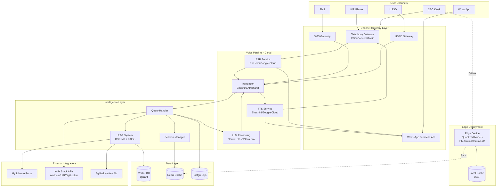

# Design Document: Rural India Voice Assistant

## Overview

The Rural India Voice Assistant is a voice-first AI system designed to provide 900+ million rural Indians with access to government schemes and civic services. The system operates across 22 scheduled Indian languages, functions on 2G networks, and maintains offline-first architecture for areas with intermittent connectivity.

The core architecture follows a cloud-edge hybrid model where:
- Cloud services handle complex ASR, translation, LLM reasoning, and TTS for connected users
- Edge devices run quantized models for offline scenarios
- Multi-channel interfaces (WhatsApp, IVR, SMS, USSD) provide flexible access
- RAG system retrieves information from 2,316+ government schemes
- India Stack integration enables authentication and transactions

Target performance: sub-1.5s voice-to-voice latency, <$0.01 per query, 99.5% uptime.

## Architecture

### High-Level System Architecture



### Architecture Principles

1. **Offline-First**: Edge devices cache models and data for zero-connectivity scenarios
2. **Low-Bandwidth Optimized**: AMR-NB codec, compressed payloads, aggressive caching
3. **Language-Agnostic Core**: Translation layer enables single LLM for all languages
4. **Modular Channel Adapters**: Unified pipeline with channel-specific input/output handlers
5. **Privacy by Design**: Data minimization, encryption, anonymization built into every layer
6. **Cost-Optimized**: Caching, batch processing, and provider selection to maintain <$0.01/query

## Components and Interfaces

### 1. Channel Gateway Layer

**Purpose**: Normalize inputs from diverse channels into unified format for voice pipeline.

**Components**:

- **Telephony Gateway**: Handles IVR calls via AWS Connect or Twilio
  - Input: Audio stream (AMR-NB, 8kHz)
  - Output: Audio stream (AMR-NB, 8kHz)
  - Features: DTMF support, call recording, session management
  
- **WhatsApp Gateway**: Integrates with WhatsApp Business API
  - Input: Text messages, voice notes (Opus codec)
  - Output: Text messages, voice notes
  - Features: Media handling, template messages, conversation threading
  
- **SMS Gateway**: Handles text-only interactions
  - Input: 160-character SMS messages
  - Output: Concatenated SMS for longer responses
  - Features: Unicode support for Indic scripts
  
- **USSD Gateway**: Supports feature phones without data
  - Input: USSD codes and menu selections
  - Output: Structured menu responses (182 characters max)
  - Features: Session-based navigation, timeout handling

**Interface**: ChannelAdapter

```typescript
interface ChannelAdapter {
  channelType: 'IVR' | 'WhatsApp' | 'SMS' | 'USSD'
  sessionId: string
  
  receiveInput(): Promise<UserInput>
  sendOutput(response: SystemResponse): Promise<void>
  maintainSession(duration: number): Promise<void>
}

interface UserInput {
  content: AudioBuffer | string
  language: LanguageCode
  metadata: {
    phoneNumber?: string
    location?: GeoCoordinates
    timestamp: Date
  }
}

interface SystemResponse {
  content: AudioBuffer | string
  language: LanguageCode
  metadata: {
    confidence: number
    processingTime: number
  }
}
```

### 2. Voice Pipeline

**Purpose**: Convert speech to text, process through LLM, and synthesize response.

**Components**:

- **ASR Service**: Speech-to-text conversion
  - Primary: Bhashini ASR (22 Indian languages)
  - Fallback: Google Cloud Speech-to-Text (15+ languages)
  - Preprocessing: VAD, noise reduction, normalization
  - Output: Transcribed text with confidence scores
  
- **Translation Service**: Cross-language communication
  - Primary: Bhashini NMT (Neural Machine Translation)
  - Fallback: AI4Bharat IndicTrans2
  - Strategy: User language → English → User language
  - Optimization: Cache common translations
  
- **LLM Reasoning**: Query understanding and response generation
  - Primary: Google Gemini Flash 1.5 (cost-optimized)
  - Fallback: Amazon Nova Pro
  - Context: System prompt with scheme knowledge, conversation history
  - Output: Structured response with citations
  
- **TTS Service**: Text-to-speech synthesis
  - Primary: Bhashini TTS (22 Indian languages)
  - Fallback: Google Cloud Text-to-Speech
  - Voice: Gender-neutral, clear pronunciation
  - Format: AMR-NB for 2G compatibility

**Interface**: VoicePipeline

```typescript
interface VoicePipeline {
  processVoiceQuery(input: AudioBuffer, language: LanguageCode): Promise<VoiceResponse>
  processTextQuery(input: string, language: LanguageCode): Promise<TextResponse>
}

interface VoiceResponse {
  audio: AudioBuffer
  transcript: string
  confidence: number
  latency: number
}

interface ASRResult {
  text: string
  confidence: number
  language: LanguageCode
  alternatives?: Array<{text: string, confidence: number}>
}

interface TranslationResult {
  translatedText: string
  sourceLanguage: LanguageCode
  targetLanguage: LanguageCode
  confidence: number
}

interface LLMResponse {
  answer: string
  citations: Array<SchemeReference>
  confidence: number
  requiresFollowup: boolean
}
```

### 3. RAG System

**Purpose**: Retrieve relevant government scheme information using semantic search.

**Components**:

- **Embedding Generator**: Creates multilingual embeddings
  - Model: BGE-M3 (multilingual, 1024 dimensions)
  - Fine-tuning: Domain-specific corpus (agriculture, health, education)
  - Languages: Separate embeddings for each of 22 languages
  
- **Vector Database**: Stores and searches embeddings
  - Primary: Qdrant (cloud-native, multilingual support)
  - Fallback: FAISS (local deployment)
  - Index: HNSW for fast approximate nearest neighbor search
  - Sharding: By language for optimized retrieval
  
- **Document Processor**: Ingests and chunks scheme documents
  - Chunking: 512-token chunks with 50-token overlap
  - Metadata: Scheme ID, category, eligibility criteria, language
  - Update frequency: Daily sync from MyScheme Portal
  
- **Retriever**: Executes semantic search
  - Strategy: Hybrid (vector similarity + keyword matching)
  - Re-ranking: LLM-based re-ranking of top 5 candidates
  - Filtering: Apply eligibility criteria based on user profile

**Interface**: RAGSystem

```typescript
interface RAGSystem {
  indexDocument(doc: SchemeDocument): Promise<void>
  search(query: string, language: LanguageCode, filters?: EligibilityFilters): Promise<SearchResults>
  updateIndex(updates: SchemeDocument[]): Promise<void>
}

interface SchemeDocument {
  schemeId: string
  title: string
  description: string
  eligibility: EligibilityCriteria
  benefits: string[]
  applicationProcess: string
  language: LanguageCode
  category: SchemeCategory
  lastUpdated: Date
}

interface SearchResults {
  results: Array<{
    document: SchemeDocument
    score: number
    relevanceExplanation: string
  }>
  totalResults: number
  queryTime: number
}

interface EligibilityFilters {
  age?: number
  gender?: 'male' | 'female' | 'other'
  occupation?: string
  income?: number
  location?: string
  category?: 'SC' | 'ST' | 'OBC' | 'General'
}
```

### 4. Session Manager

**Purpose**: Maintain conversation context and user state across interactions.

**Components**:

- **Session Store**: Persists conversation state
  - Storage: Redis (in-memory, fast access)
  - TTL: 30 minutes for active sessions, 24 hours for resumable
  - Data: Conversation history, user preferences, current topic
  
- **Context Tracker**: Manages multi-turn conversations
  - History: Last 20 turns or 4096 tokens
  - Resolution: Pronoun and reference resolution
  - Topic: Current topic tracking for continuity
  
- **User Profile**: Stores user preferences and demographics
  - Storage: PostgreSQL (persistent)
  - Data: Language preference, location, occupation, frequently asked topics
  - Privacy: Encrypted at rest, anonymized for analytics

**Interface**: SessionManager

```typescript
interface SessionManager {
  createSession(channelType: string, userId?: string): Promise<Session>
  getSession(sessionId: string): Promise<Session>
  updateSession(sessionId: string, update: SessionUpdate): Promise<void>
  endSession(sessionId: string): Promise<void>
}

interface Session {
  sessionId: string
  userId?: string
  channelType: string
  language: LanguageCode
  conversationHistory: ConversationTurn[]
  userProfile?: UserProfile
  createdAt: Date
  lastActivity: Date
}

interface ConversationTurn {
  role: 'user' | 'assistant'
  content: string
  timestamp: Date
  metadata: {
    confidence?: number
    schemeReferences?: string[]
  }
}

interface UserProfile {
  demographics: {
    age?: number
    gender?: string
    occupation?: string
    location?: string
  }
  preferences: {
    language: LanguageCode
    voiceSpeed?: number
  }
  frequentTopics: string[]
}
```

### 5. Query Handler

**Purpose**: Orchestrate query processing, information retrieval, and response generation.

**Components**:

- **Intent Classifier**: Determines query type
  - Categories: Scheme search, eligibility check, application help, general info
  - Model: Fine-tuned BERT classifier
  - Confidence threshold: 0.7 for automatic routing
  
- **Eligibility Checker**: Validates user eligibility for schemes
  - Input: User profile + scheme criteria
  - Logic: Rule-based matching with fuzzy logic for edge cases
  - Output: Eligibility status with explanation
  
- **Response Generator**: Constructs natural language responses
  - Template: Structured response format
  - Personalization: Adapt to user's language proficiency
  - Citations: Include scheme IDs and sources

**Interface**: QueryHandler

```typescript
interface QueryHandler {
  handleQuery(query: string, session: Session): Promise<QueryResponse>
  checkEligibility(userId: string, schemeId: string): Promise<EligibilityResult>
}

interface QueryResponse {
  answer: string
  schemeReferences: SchemeDocument[]
  followupSuggestions: string[]
  requiresAction: boolean
  actionType?: 'authentication' | 'document_upload' | 'payment'
}

interface EligibilityResult {
  eligible: boolean
  explanation: string
  missingCriteria?: string[]
  alternativeSchemes?: string[]
}
```

### 6. Edge Device Module

**Purpose**: Enable offline operation with locally cached models and data.

**Components**:

- **Quantized Models**: 4-bit compressed models for resource-constrained devices
  - ASR: Whisper-small quantized (244MB)
  - LLM: Phi-3-mini-4bit or Gemma-2B-4bit (2GB)
  - TTS: Lightweight neural vocoder (150MB)
  
- **Local Cache**: Stores frequently accessed scheme data
  - Format: SQLite database (2GB max)
  - Content: Top 500 schemes, embeddings, user sessions
  - Sync: Differential sync when connectivity available
  
- **Sync Manager**: Handles cloud-edge synchronization
  - Strategy: Delta sync for scheme updates
  - Priority: User-specific data first, then popular schemes
  - Conflict resolution: Cloud data takes precedence

**Interface**: EdgeDevice

```typescript
interface EdgeDevice {
  processOfflineQuery(audio: AudioBuffer, language: LanguageCode): Promise<OfflineResponse>
  syncWithCloud(): Promise<SyncResult>
  getCacheStatus(): CacheStatus
}

interface OfflineResponse {
  audio: AudioBuffer
  transcript: string
  confidence: number
  fromCache: boolean
  requiresCloudProcessing: boolean
}

interface SyncResult {
  schemesUpdated: number
  modelsUpdated: boolean
  lastSyncTime: Date
  nextSyncTime: Date
}

interface CacheStatus {
  totalSize: number
  availableSpace: number
  schemeCount: number
  lastUpdate: Date
}
```

### 7. India Stack Integration Module

**Purpose**: Integrate with government digital infrastructure for authentication and services.

**Components**:

- **Aadhaar Connector**: eKYC and authentication
  - API: UIDAI eKYC API
  - Auth: OTP-based verification
  - Data: Demographic details (name, DOB, address)
  
- **UPI Connector**: Payment processing
  - API: NPCI UPI APIs
  - Flow: Intent-based payment for scheme fees
  - Confirmation: Transaction status in user's language
  
- **DigiLocker Connector**: Document retrieval
  - API: DigiLocker Pull API
  - Documents: Aadhaar, PAN, certificates
  - Consent: Explicit user consent before access
  
- **ABDM Connector**: Health records
  - API: ABDM Health Information Exchange
  - Data: Health ID, medical records
  - Privacy: HIPAA-equivalent protections

**Interface**: IndiaStackConnector

```typescript
interface IndiaStackConnector {
  authenticateAadhaar(aadhaarNumber: string, otp: string): Promise<AadhaarAuthResult>
  initiateUPIPayment(amount: number, purpose: string): Promise<UPIPaymentIntent>
  fetchDigiLockerDocument(docType: string, consent: boolean): Promise<Document>
  getHealthRecords(healthId: string, consent: boolean): Promise<HealthRecord[]>
}

interface AadhaarAuthResult {
  authenticated: boolean
  demographics?: {
    name: string
    dob: Date
    gender: string
    address: string
  }
  errorCode?: string
}

interface UPIPaymentIntent {
  intentUrl: string
  transactionId: string
  amount: number
  expiresAt: Date
}
```

### 8. Privacy Controller

**Purpose**: Enforce DPDPA 2023 compliance across all system operations.

**Components**:

- **Consent Manager**: Tracks user consent
  - Storage: PostgreSQL with audit trail
  - Granularity: Per-purpose consent (authentication, analytics, personalization)
  - Expiry: Consent valid for 12 months, requires renewal
  
- **Data Anonymizer**: Removes PII from logs and analytics
  - Techniques: Hashing, tokenization, generalization
  - Scope: Phone numbers, Aadhaar, location data
  - Retention: Anonymized data retained for 90 days
  
- **Encryption Service**: Secures data at rest and in transit
  - At rest: AES-256-GCM
  - In transit: TLS 1.3
  - Key management: AWS KMS or Google Cloud KMS
  
- **Access Controller**: Manages data access requests
  - Rights: Access, deletion, portability
  - Timeline: 7 days for access, 30 days for deletion
  - Verification: Multi-factor authentication for sensitive requests

**Interface**: PrivacyController

```typescript
interface PrivacyController {
  obtainConsent(userId: string, purpose: ConsentPurpose): Promise<ConsentRecord>
  checkConsent(userId: string, purpose: ConsentPurpose): Promise<boolean>
  anonymizeData(data: any): any
  handleDataRequest(userId: string, requestType: DataRequestType): Promise<DataRequestResult>
}

interface ConsentRecord {
  userId: string
  purpose: ConsentPurpose
  granted: boolean
  timestamp: Date
  expiresAt: Date
}

type ConsentPurpose = 'authentication' | 'personalization' | 'analytics' | 'marketing'
type DataRequestType = 'access' | 'deletion' | 'portability'

interface DataRequestResult {
  requestId: string
  status: 'pending' | 'completed' | 'rejected'
  data?: any
  completionDate?: Date
}
```

## Data Models

### Core Entities

**User**
```typescript
interface User {
  userId: string
  phoneNumber: string  // Hashed
  demographics: {
    age?: number
    gender?: string
    occupation?: string
    location?: {
      state: string
      district: string
      block?: string
      village?: string
    }
    category?: 'SC' | 'ST' | 'OBC' | 'General'
  }
  preferences: {
    primaryLanguage: LanguageCode
    secondaryLanguages?: LanguageCode[]
    voiceSpeed?: number
  }
  authentication: {
    aadhaarLinked: boolean
    upiLinked: boolean
    digiLockerLinked: boolean
  }
  createdAt: Date
  lastActive: Date
}
```

**Scheme**
```typescript
interface Scheme {
  schemeId: string
  title: Record<LanguageCode, string>
  description: Record<LanguageCode, string>
  category: SchemeCategory
  ministry: string
  eligibility: {
    age?: { min?: number, max?: number }
    gender?: string[]
    occupation?: string[]
    income?: { max?: number }
    location?: string[]
    category?: string[]
    customCriteria?: Record<string, any>
  }
  benefits: Record<LanguageCode, string[]>
  applicationProcess: Record<LanguageCode, ApplicationStep[]>
  documents: DocumentRequirement[]
  contactInfo: {
    helpline?: string
    website?: string
    email?: string
  }
  metadata: {
    source: 'MyScheme' | 'AgMarkNet' | 'e-NAM' | 'PM-KISAN'
    lastUpdated: Date
    popularity: number
  }
}

type SchemeCategory = 
  | 'agriculture'
  | 'health'
  | 'education'
  | 'housing'
  | 'employment'
  | 'social_welfare'
  | 'financial_inclusion'

interface ApplicationStep {
  stepNumber: number
  description: string
  action: 'visit_office' | 'online_form' | 'document_upload' | 'payment'
  details: string
}

interface DocumentRequirement {
  documentType: string
  mandatory: boolean
  digiLockerAvailable: boolean
}
```

**Conversation**
```typescript
interface Conversation {
  conversationId: string
  sessionId: string
  userId?: string
  channel: 'IVR' | 'WhatsApp' | 'SMS' | 'USSD'
  language: LanguageCode
  turns: ConversationTurn[]
  metadata: {
    startTime: Date
    endTime?: Date
    totalDuration?: number
    schemesDiscussed: string[]
    outcome?: 'information_provided' | 'application_initiated' | 'escalated' | 'abandoned'
  }
  analytics: {
    asrAccuracy: number
    translationQuality: number
    userSatisfaction?: number
  }
}
```

**Transaction**
```typescript
interface Transaction {
  transactionId: string
  userId: string
  type: 'scheme_application' | 'document_verification' | 'payment'
  schemeId?: string
  amount?: number
  status: 'initiated' | 'pending' | 'completed' | 'failed'
  channel: string
  cscId?: string  // If processed through CSC
  revenue: {
    total: number
    cscShare: number
    platformShare: number
    governmentShare: number
  }
  timestamp: Date
}
```

### Database Schema

**PostgreSQL Tables**:
- `users`: User profiles and demographics
- `schemes`: Government scheme master data
- `conversations`: Conversation logs (anonymized)
- `transactions`: Transaction records for revenue sharing
- `consent_records`: DPDPA consent tracking
- `audit_logs`: System access and data processing logs

**Redis Cache**:
- `session:{sessionId}`: Active session data (TTL: 30 min)
- `user_profile:{userId}`: Cached user profiles (TTL: 24 hours)
- `scheme_cache:{schemeId}:{language}`: Frequently accessed schemes (TTL: 7 days)
- `translation_cache:{hash}`: Common translations (TTL: 30 days)

**Vector Database (Qdrant)**:
- Collections: One per language (22 collections)
- Vectors: 1024-dimensional BGE-M3 embeddings
- Payload: Scheme metadata for filtering
- Index: HNSW with M=16, ef_construct=100

## Correctness Properties

*A property is a characteristic or behavior that should hold true across all valid executions of a system—essentially, a formal statement about what the system should do. Properties serve as the bridge between human-readable specifications and machine-verifiable correctness guarantees.*


### Property Reflection

After analyzing all acceptance criteria, I've identified the following consolidations to eliminate redundancy:

**Redundancies Identified:**
1. Properties 2.1, 2.2 (language support) are examples that verify implementation, not properties
2. Properties 6.1-6.4 (channel support) are implementation checks, consolidated into channel functionality property
3. Properties 8.1-8.4 (India Stack integrations) are examples, not properties
4. Property 10.2 duplicates 6.1 and 6.2
5. Properties about performance benchmarks (9.1-9.6) are not unit-testable
6. Properties about deployment capabilities (10.1, 10.4, 10.7) are not functional tests

**Consolidations:**
- Combine 1.4 (noise handling) with 12.1-12.3 (noise reduction, VAD, speaker separation) into comprehensive audio preprocessing property
- Combine 4.6 (caching) with 5.3 (offline cache access) into unified caching property
- Combine 7.3 and 7.4 (encryption at rest and in transit) into single encryption property
- Combine 15.1, 15.2, 15.3 (logging and metrics) into comprehensive observability property

**Final Property Set:** 45 unique, non-redundant properties covering all testable acceptance criteria.

### Correctness Properties

Property 1: Multilingual ASR Processing
*For any* audio input in any of the 22 scheduled Indian languages, the Voice_Pipeline should successfully convert speech to text using ASR
**Validates: Requirements 1.1**

Property 2: Voice-to-Voice Latency
*For any* user query, when ASR produces text output, the Voice_Pipeline should process it and produce spoken response within 1.5 seconds for 95% of queries
**Validates: Requirements 1.2**

Property 3: Translation Round-Trip Preservation
*For any* input text in a supported language, translating to processing language and back to original language should preserve semantic meaning
**Validates: Requirements 1.3**

Property 4: Audio Preprocessing Pipeline
*For any* audio input containing background noise above -20dB SNR or multiple speakers, the Voice_Pipeline should apply VAD, noise reduction, and speaker isolation before ASR processing
**Validates: Requirements 1.4, 12.1, 12.2, 12.3**

Property 5: Codec Selection Based on Bandwidth
*For any* network connection with bandwidth below 12.2 kbps, the Voice_Pipeline should use AMR-NB codec for audio transmission
**Validates: Requirements 1.5**

Property 6: Conversation Context Preservation
*For any* multi-turn conversation up to 20 turns or 30 minutes, the Voice_Pipeline should maintain context and resolve references to previous information correctly
**Validates: Requirements 1.6, 13.1, 13.2**

Property 7: Low Confidence Clarification
*For any* ASR output with confidence score below 0.7, the Voice_Pipeline should request clarification from the user
**Validates: Requirements 1.7**

Property 8: Language Detection and Switching
*For any* conversation where the user switches language mid-conversation, the Voice_Pipeline should detect the language change and adapt accordingly
**Validates: Requirements 2.4**

Property 9: Comprehensive Scheme Search
*For any* user query about government schemes, the Query_Handler should search across all 2,316+ schemes from MyScheme_Portal
**Validates: Requirements 3.1**

Property 10: Eligibility Determination
*For any* user profile and scheme combination, the Query_Handler should correctly determine eligibility based on demographics, location, and occupation
**Validates: Requirements 3.2**

Property 11: Complete Scheme Information Response
*For any* scheme query response, the Query_Handler should provide scheme name, benefits, eligibility criteria, and application process
**Validates: Requirements 3.3**

Property 12: Localized Application Guidance
*For any* application assistance request, the Query_Handler should provide step-by-step guidance in the user's selected language
**Validates: Requirements 3.4**

Property 13: Relevance-Based Ranking
*For any* query matching multiple schemes, the Query_Handler should rank results by relevance and present top 5 options
**Validates: Requirements 3.7**

Property 14: Payload Compression
*For any* data transmission over 2G networks, the Voice_Pipeline should compress payloads to minimize data transfer
**Validates: Requirements 4.2**

Property 15: Latency Feedback
*For any* query where network latency exceeds 500ms, the Voice_Pipeline should provide user feedback indicating processing status
**Validates: Requirements 4.3**

Property 16: Audio Sample Rate Limiting
*For any* audio transmission, the Voice_Pipeline should limit streaming to 8kHz sample rate for 2G compatibility
**Validates: Requirements 4.4**

Property 17: Retry Logic with Exponential Backoff
*For any* network connection failure, the Voice_Pipeline should implement retry logic with exponential backoff
**Validates: Requirements 4.5**

Property 18: Unified Caching Strategy
*For any* frequently accessed scheme information, the system should cache data to reduce network requests and enable offline access
**Validates: Requirements 4.6, 5.3**

Property 19: Performance Logging
*For any* query with voice-to-voice latency exceeding 3 seconds, the Voice_Pipeline should log performance metrics for optimization
**Validates: Requirements 4.7**

Property 20: Offline Query Processing
*For any* query when network connectivity is unavailable, the Edge_Device should process it using locally cached models
**Validates: Requirements 5.1**

Property 21: Cloud Synchronization
*For any* Edge_Device, when connectivity is restored, it should sync conversation logs and updated scheme data with cloud services
**Validates: Requirements 5.4**

Property 22: Offline Confidence Fallback
*For any* offline query with model confidence below 0.6, the Edge_Device should queue it for cloud processing when online
**Validates: Requirements 5.6**

Property 23: Cache Size Constraint
*For any* Edge_Device, the local cache size should remain below 2GB for deployment on resource-constrained devices
**Validates: Requirements 5.7**

Property 24: Channel-Specific Context Management
*For any* user initiating contact through any channel (IVR, WhatsApp, SMS, USSD), the Session_Manager should maintain conversation context within that channel
**Validates: Requirements 6.5**

Property 25: Cross-Channel Session Resumption
*For any* user switching between channels, the Session_Manager should allow conversation resumption using session identifiers
**Validates: Requirements 6.6**

Property 26: WhatsApp Multi-Format Support
*For any* WhatsApp interaction, the Voice_Pipeline should support both text messages and voice notes
**Validates: Requirements 6.8**

Property 27: Consent Before Data Collection
*For any* personal data collection, the Privacy_Controller should obtain explicit user consent before proceeding
**Validates: Requirements 7.1**

Property 28: Data Deletion Within Timeline
*For any* user data deletion request, the Privacy_Controller should complete deletion within 30 days
**Validates: Requirements 7.2**

Property 29: Comprehensive Encryption
*For any* personal data, the Privacy_Controller should encrypt it at rest using AES-256 and in transit using TLS 1.3
**Validates: Requirements 7.3, 7.4**

Property 30: Conversation Log Anonymization
*For any* conversation log stored, the Privacy_Controller should anonymize all personally identifiable information
**Validates: Requirements 7.5**

Property 31: Minimum Data Retention
*For any* user data, the Privacy_Controller should retain it only for the minimum period required by law
**Validates: Requirements 7.6**

Property 32: Data Access Within Timeline
*For any* user data access request, the Privacy_Controller should provide the data within 7 days
**Validates: Requirements 7.7**

Property 33: Enhanced Consent for Sensitive Data
*For any* sensitive data category processing, the Privacy_Controller should apply additional consent requirements per DPDPA 2023
**Validates: Requirements 7.8**

Property 34: Data Localization
*For any* Indian user data, the Privacy_Controller should store it within India
**Validates: Requirements 7.9**

Property 35: Audit Logging
*For any* data access or processing activity, the Privacy_Controller should maintain audit logs
**Validates: Requirements 7.10**

Property 36: Aadhaar OTP Verification
*For any* user authentication, the Voice_Pipeline should support Aadhaar-based OTP verification
**Validates: Requirements 8.5**

Property 37: Consent Before Document Access
*For any* DigiLocker document access, the Voice_Pipeline should request user consent before retrieval
**Validates: Requirements 8.6**

Property 38: India Stack Rate Limit Compliance
*For any* India Stack API call, the Voice_Pipeline should comply with rate limits and security requirements
**Validates: Requirements 8.7**

Property 39: Localized Transaction Confirmation
*For any* UPI transaction initiated, the Voice_Pipeline should provide transaction confirmation in user's language
**Validates: Requirements 8.8**

Property 40: Zero-Downtime Updates
*For any* batch update of scheme data, the Voice_Pipeline should process it without service interruption
**Validates: Requirements 9.7**

Property 41: CSC Transaction Logging
*For any* transaction accessed through CSC, the Voice_Pipeline should log it with CSC ID for 80:12:8 revenue split calculation
**Validates: Requirements 10.3, 10.5**

Property 42: Multilingual Embedding Generation
*For any* scheme document indexed, the RAG_System should create language-specific embeddings for all 22 languages
**Validates: Requirements 11.2**

Property 43: Ambiguous Query Re-Ranking
*For any* ambiguous user query, the RAG_System should retrieve top 5 candidate documents and use LLM for re-ranking
**Validates: Requirements 11.5**

Property 44: Incremental Index Updates
*For any* new scheme data added, the RAG_System should update vector indices incrementally without full rebuild
**Validates: Requirements 11.6**

Property 45: Semantic Search Fallback
*For any* semantic search with confidence below 0.5, the RAG_System should fall back to keyword-based search
**Validates: Requirements 11.7**

Property 46: Poor Audio Quality Handling
*For any* audio input with insufficient quality for reliable ASR, the Voice_Pipeline should request user to repeat input
**Validates: Requirements 12.5**

Property 47: Acoustic Echo Cancellation
*For any* IVR audio input, the Voice_Pipeline should apply acoustic echo cancellation
**Validates: Requirements 12.6**

Property 48: User Preference Tracking
*For any* session, the Session_Manager should track user preferences and frequently asked topics
**Validates: Requirements 13.4**

Property 49: Topic Continuity
*For any* follow-up question, the Session_Manager should maintain topic continuity from previous turns
**Validates: Requirements 13.5**

Property 50: Sensitive Context Cleanup
*For any* transaction completion, the Session_Manager should clear sensitive information from context
**Validates: Requirements 13.6**

Property 51: Session Timeout Notification
*For any* session timeout, the Session_Manager should notify user and offer to save conversation state
**Validates: Requirements 13.7**

Property 52: Session Resumption Window
*For any* interrupted conversation, the Session_Manager should allow resumption within 24 hours using session ID
**Validates: Requirements 13.3**

Property 53: ASR Failure Recovery
*For any* ASR transcription failure, the Voice_Pipeline should request user to repeat in simpler terms
**Validates: Requirements 14.1**

Property 54: Translation Clarification
*For any* translation with low confidence, the Voice_Pipeline should ask clarifying questions in user's language
**Validates: Requirements 14.2**

Property 55: API Failure Graceful Degradation
*For any* external API call failure, the Voice_Pipeline should provide graceful degradation using cached data
**Validates: Requirements 14.3**

Property 56: Human Escalation Offer
*For any* query the LLM cannot answer, the Voice_Pipeline should offer to connect user with human operator
**Validates: Requirements 14.4**

Property 57: Localized Error Messages
*For any* error condition, the Voice_Pipeline should provide error messages in user's selected language
**Validates: Requirements 14.5**

Property 58: Request Queueing with Wait Time
*For any* high load condition, the Voice_Pipeline should queue requests and provide estimated wait time
**Validates: Requirements 14.6**

Property 59: Service Status Communication
*For any* critical service unavailability, the Voice_Pipeline should display service status and alternative contact methods
**Validates: Requirements 14.7**

Property 60: Comprehensive Query Logging
*For any* query processed, the Voice_Pipeline should log timestamp, language, channel, response time, and all required metrics
**Validates: Requirements 15.1, 15.2, 15.3**

Property 61: Error Rate Alerting
*For any* time period where error rates exceed 5%, the Voice_Pipeline should trigger alerts to operations team
**Validates: Requirements 15.5**

Property 62: Cost Tracking Per Provider
*For any* LLM query, the Voice_Pipeline should track cost per query across different providers
**Validates: Requirements 15.6**

Property 63: Analytics Anonymization
*For any* analytics data collected, the Voice_Pipeline should anonymize it to comply with DPDPA requirements
**Validates: Requirements 15.7**

## Error Handling

### Error Categories and Strategies

**1. Speech Processing Errors**
- ASR failure: Request repeat with simpler language
- Low confidence (<0.7): Ask clarifying questions
- Noise interference: Apply enhanced noise reduction, request quieter environment
- Language detection failure: Prompt user to select language explicitly

**2. Translation Errors**
- Low confidence translation: Ask clarifying questions in source language
- Unsupported language pair: Route through English as intermediate
- Context loss: Simplify sentence structure, break into smaller chunks

**3. Network and Connectivity Errors**
- Connection timeout: Retry with exponential backoff (1s, 2s, 4s, 8s)
- Bandwidth insufficient: Downgrade to lower quality codec, reduce payload size
- Complete offline: Switch to edge device processing
- Partial connectivity: Queue non-critical operations, prioritize user-facing responses

**4. Data Retrieval Errors**
- Scheme not found: Suggest similar schemes, offer broader search
- API failure: Fall back to cached data with staleness warning
- Rate limit exceeded: Queue request, provide wait time estimate
- Empty results: Suggest alternative search terms, show popular schemes

**5. Authentication and Authorization Errors**
- Aadhaar OTP failure: Retry up to 3 times, offer alternative authentication
- Consent not granted: Explain requirement, offer to proceed without optional features
- Session expired: Offer to resume with session ID or start fresh
- Invalid credentials: Clear error message, offer password reset/support

**6. Privacy and Compliance Errors**
- Data deletion failure: Log for manual review, notify user of delay
- Encryption failure: Reject operation, log security incident
- Consent expired: Re-request consent before proceeding
- Data localization violation: Block operation, alert compliance team

**7. System Overload Errors**
- High load: Queue requests with position and wait time
- Resource exhaustion: Trigger auto-scaling, provide degraded service
- Circuit breaker open: Return cached responses, show service status
- Database unavailable: Use read replicas, fall back to cache

### Error Response Format

All errors should follow consistent structure:

```typescript
interface ErrorResponse {
  errorCode: string
  message: string  // Localized to user's language
  severity: 'info' | 'warning' | 'error' | 'critical'
  recoverable: boolean
  suggestedAction?: string
  alternativeOptions?: string[]
  supportContact?: string
}
```

### Fallback Chain

1. **Primary Service** → 2. **Secondary Service** → 3. **Cached Data** → 4. **Degraded Service** → 5. **Human Escalation**

Example for ASR:
1. Bhashini ASR → 2. Google Cloud STT → 3. Offline quantized model → 4. Text-only fallback → 5. Human operator

## Testing Strategy

### Dual Testing Approach

The system requires both unit testing and property-based testing for comprehensive coverage:

**Unit Tests**: Verify specific examples, edge cases, and error conditions
- Specific language examples (Hindi, Tamil, Bengali)
- Edge cases (empty input, very long audio, special characters)
- Error conditions (network failures, API timeouts, invalid data)
- Integration points (API contracts, database schemas)

**Property-Based Tests**: Verify universal properties across all inputs
- Minimum 100 iterations per property test
- Random generation of audio, text, user profiles, schemes
- Each test references design document property
- Tag format: **Feature: rural-india-voice-assistant, Property {number}: {property_text}**

### Property-Based Testing Configuration

**Framework Selection by Language**:
- Python: Hypothesis
- TypeScript/JavaScript: fast-check
- Java: jqwik
- Go: gopter

**Test Configuration**:
```python
# Example Hypothesis configuration
@given(
    audio=strategies.audio_buffers(languages=SUPPORTED_LANGUAGES),
    language=strategies.sampled_from(SUPPORTED_LANGUAGES)
)
@settings(max_examples=100, deadline=5000)
def test_property_1_multilingual_asr(audio, language):
    """
    Feature: rural-india-voice-assistant
    Property 1: Multilingual ASR Processing
    For any audio input in any of the 22 scheduled Indian languages,
    the Voice_Pipeline should successfully convert speech to text using ASR
    """
    result = voice_pipeline.process_voice_query(audio, language)
    assert result.transcript is not None
    assert len(result.transcript) > 0
    assert result.confidence >= 0.0
```

### Test Coverage Requirements

**Unit Test Coverage**:
- Channel adapters: Test each channel type (IVR, WhatsApp, SMS, USSD)
- India Stack integrations: Mock API responses for Aadhaar, UPI, DigiLocker, ABDM
- Privacy controls: Test consent flows, encryption, anonymization
- Error handling: Test each error category with specific examples

**Property Test Coverage**:
- All 63 correctness properties must have corresponding property tests
- Each property test must run minimum 100 iterations
- Properties should cover: voice pipeline, RAG system, session management, privacy controls

**Integration Test Coverage**:
- End-to-end voice query flow across all channels
- Multi-turn conversations with context preservation
- Offline-to-online synchronization
- Revenue sharing calculation for CSC transactions

**Performance Test Coverage**:
- Voice-to-voice latency under various network conditions
- Concurrent session handling (target: 10,000 sessions)
- RAG retrieval speed (target: <200ms for 90% of queries)
- Edge device performance with quantized models

### Test Data Strategy

**Synthetic Data Generation**:
- Audio: Generate synthetic speech in 22 languages using TTS
- Schemes: Create representative scheme documents covering all categories
- User profiles: Generate diverse demographics, locations, occupations
- Network conditions: Simulate 2G, 3G, 4G, offline scenarios

**Real Data (Anonymized)**:
- Pilot deployment data from select CSCs
- Anonymized conversation logs
- Actual scheme data from MyScheme Portal
- Real audio samples with consent (for accent/dialect testing)

### Continuous Testing

**Pre-commit**:
- Unit tests for changed components
- Linting and type checking
- Security scanning

**CI Pipeline**:
- Full unit test suite
- Property-based tests (100 iterations)
- Integration tests
- Code coverage report (target: >80%)

**Nightly**:
- Extended property tests (1000 iterations)
- Performance benchmarks
- Security penetration testing
- Compliance validation

**Pre-release**:
- Full regression suite
- Load testing (10,000 concurrent users)
- Multi-language validation
- Privacy audit
- Accessibility testing

### Monitoring and Observability

**Metrics to Track**:
- Voice-to-voice latency (p50, p95, p99)
- ASR accuracy per language
- Translation quality scores
- RAG retrieval relevance
- Error rates by category
- Cost per query by provider
- User satisfaction scores
- Session completion rates

**Logging Strategy**:
- Structured JSON logs
- Correlation IDs for request tracing
- PII anonymization in logs
- Log retention: 90 days
- Log levels: DEBUG, INFO, WARN, ERROR, CRITICAL

**Alerting Thresholds**:
- Error rate >5%: Page on-call engineer
- Latency p95 >3s: Warning alert
- API failure rate >10%: Critical alert
- Cost per query >$0.015: Budget alert
- Cache hit rate <70%: Performance alert

**Dashboards**:
- Real-time system health
- Language-wise usage distribution
- Geographic query heatmap
- Scheme popularity trends
- Revenue by CSC
- Cost breakdown by provider
